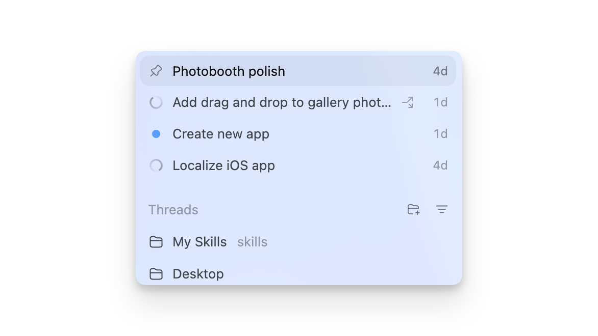

# 快速入门

本篇解决三个问题：如何打开项目、如何新建线程、如何在发送任务前选对模式和权限。刚开始使用 Codex Desktop 时，不要急着让它改代码，先让它读懂你的项目、工具链和边界。


## 适合场景

- 第一次在 Codex Desktop 中打开一个本地项目。
- 想让 Codex 解释代码、修改代码、生成文档或运行测试。
- 项目在 Windows 本地目录、Git 仓库、WSL2 环境或多个工作区之间切换。

## 第一次打开项目

1. 在 Codex Desktop 的项目列表中添加项目目录。
2. 优先选择**仓库根目录**，而不是上一级大目录。这样 Codex 更容易找到 `README`、`package.json`、`pyproject.toml`、`.git`、`AGENTS.md` 等关键文件。
3. 如果项目很大，第一条消息建议只做只读分析，不要直接改文件。
4. 让 Codex 说明它看到的项目结构、测试命令、启动命令和潜在风险。

推荐第一条提示词：

```text
请先只读分析这个项目，不要修改文件。
请告诉我：
1. 项目主要技术栈是什么；
2. 入口文件和关键目录在哪里；
3. 常用的测试、lint、构建命令可能是什么；
4. 如果后续让你修改代码，哪些文件或目录需要谨慎处理。
```

## 新建线程

一个线程最好对应一个清晰目标。线程太杂会导致上下文变乱、diff 变大，也会让最终审查困难。



适合一个线程处理：

- 修复一个明确 bug。
- 实现一个页面或一个 API。
- 审查一组改动。
- 解释某个模块。
- 生成一套文档。

不适合塞进同一个线程：

- “顺便把整个项目优化一下”。
- 同时改前端、后端、部署和文档。
- 没有验收标准的大范围重构。
- 多个仓库之间互不相关的任务。

## 选择 Local、Worktree 或 Cloud

Codex app 支持多种运行模式。实际可见选项取决于你的账号、项目和配置。


| 模式 | 适合场景 | 注意事项 |
| --- | --- | --- |
| Local | 小范围、明确、安全的改动 | 直接作用在当前项目目录，提交前一定看 diff |
| Worktree | 探索方案、并行任务、风险较高的改动 | 需要 Git 仓库；更适合试错和自动化 |
| Cloud | 托管环境、远程任务、与 GitHub 等云工作流结合 | 依赖环境配置和账号权限 |

入门建议：

- **解释代码、写文档、只读调研**：Local 即可，但要求“不要改文件”。
- **修小 bug**：Local 或 Worktree 都可以；如果你当前目录有未提交改动，优先 Worktree。
- **复杂重构或实验性功能**：优先 Worktree。
- **需要长期后台运行或云端 PR 工作流**：再考虑 Cloud。

## 发送任务前检查 5 件事

- 项目是否选对：路径是不是仓库根目录。
- 目标是否明确：要改什么、不要改什么、完成后如何判断。
- 工作模式是否合适：Local 还是 Worktree。
- 权限是否过宽：是否真的需要联网、写外部目录或执行高风险命令。
- 验证方式是否明确：测试命令、构建命令、浏览器检查路径。

## 常见错误

**错误：一上来就说“帮我优化项目”。**  
更好的做法：先让 Codex 找出 3 个具体可改进点，选一个再实施。

**错误：在有未提交改动的 Local 里做大改。**  
更好的做法：先 `git status`，或用 Worktree 隔离。

**错误：只看 Codex 的总结，不看真实 diff。**  
更好的做法：每次修改后打开 Review 面板，看文件列表和逐行 diff。

**错误：批准所有权限请求。**  
更好的做法：让 Codex 解释为什么需要该命令、会改哪里、是否有更窄的替代命令。

## 好物推荐：新手先装什么

刚开始不要追求“全家桶”。最值得优先配置的是那些每天都会减少手工切换的能力。

| 推荐 | 类型 | 提升什么效率 | 适合谁 |
| --- | --- | --- | --- |
| in-app browser / Browser 插件 | 浏览器预览 | 预览 localhost、检查页面、做视觉反馈 | 前端、全栈、文档站维护者 |
| OpenAI Docs MCP 或官方文档 MCP | MCP | 查最新官方文档，减少过时 API 用法 | 经常接 OpenAI、SDK、框架文档的人 |
| GitHub 集成或 GitHub MCP | MCP / App | 读取 issue、PR、CI、仓库上下文 | 代码主要在 GitHub 上协作的团队 |
| `$skill-installer` | Skill | 安装官方或第三方 curated skills | 想扩展本地 Codex 能力的人 |
| `$skill-creator` | Skill | 把常用提示词变成稳定工作流 | 经常重复同一类任务的人 |
| Chrome 插件 | Plugin | 处理需要登录态的网站任务 | 需要让 Codex 看 Gmail、CRM、内部系统的人 |

入门安装顺序建议：

1. 先用内置能力把项目读懂：Git、Review 面板、集成终端、in-app browser。
2. 再接一个高频外部来源：GitHub、Figma、OpenAI Docs、Linear 或 Google Drive 选一个。
3. 等你发现某类提示词重复出现 3 次以上，再用 `$skill-creator` 做成 Skill。
4. 不要一开始就安装所有 MCP。工具越多，授权面、噪声和误用风险也越大。

不建议新手一开始就用：

- **Computer Use**：它很强，但适合没有结构化 API 的桌面软件；有插件或 MCP 时优先用后者。
- **全权限自动化**：先从只读、手动审查开始。
- **大量团队协作插件**：Slack、Gmail、Drive、Linear 都有价值，但必须先明确输出目标，否则会变成信息噪声。

## 快速模板

```text
目标：修复设置页在移动端按钮换行异常的问题。

范围：
- 只改前端布局相关文件。
- 不改接口协议、不改路由、不引入新依赖。

请先：
1. 阅读相关组件和样式；
2. 给出修改计划；
3. 说明要运行哪些验证；
4. 等我确认后再改文件。
```

## 检查清单

- [ ] 已选中正确项目目录。
- [ ] 已说明是否允许修改文件。
- [ ] 已说明范围、限制和验收标准。
- [ ] 已选合适模式：Local / Worktree / Cloud。
- [ ] 已要求 Codex 在最终说明里写明验证命令和结果。

## 官方参考

- [Codex app](https://developers.openai.com/codex/app)
- [Codex app features](https://developers.openai.com/codex/app/features)
- [Codex app settings](https://developers.openai.com/codex/app/settings)
- [Codex app for Windows](https://developers.openai.com/codex/app/windows)
