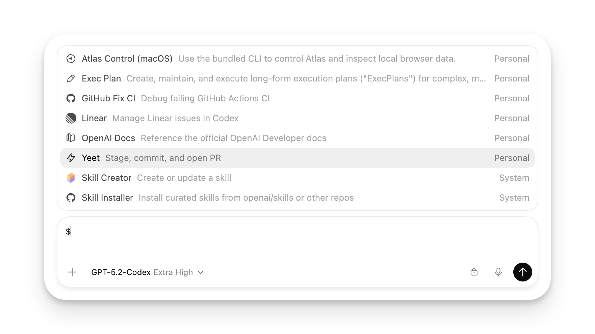
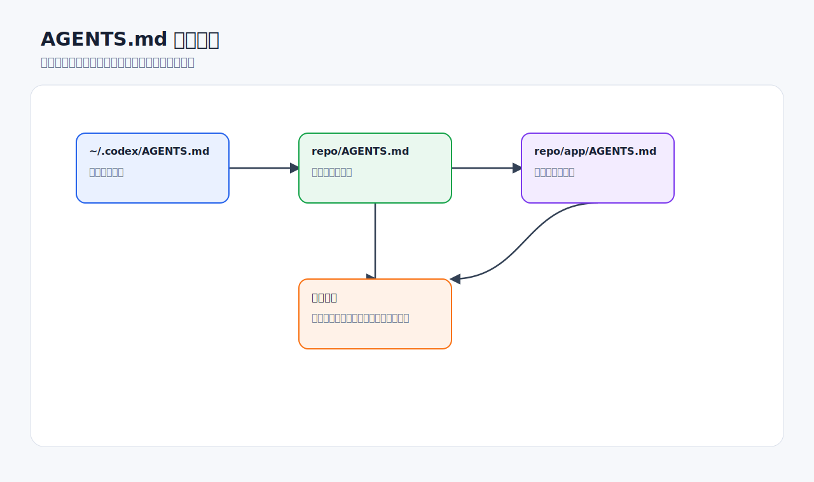
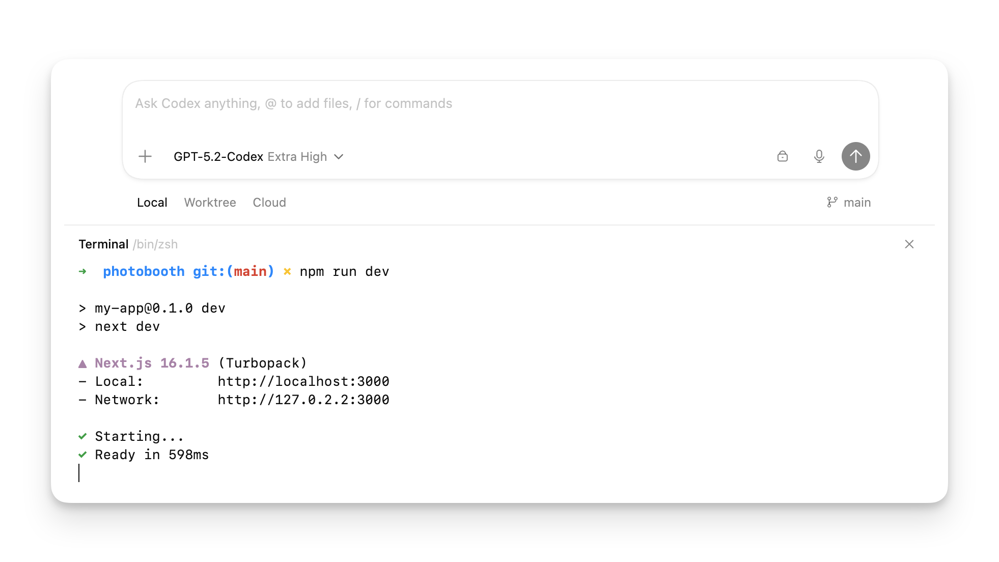

# 项目上下文与 AGENTS.md

`AGENTS.md` 是给 Codex 的长期项目说明。它适合放那些你不想每次重复说的内容：项目怎么构建、怎么测试、代码风格、审查重点、不能触碰的目录、发布注意事项。



## 什么时候需要 AGENTS.md

当你发现自己经常重复这些要求时，就应该写进 `AGENTS.md`：

- “改完请运行 `npm test` 和 `npm run lint`。”
- “不要改 `generated/` 目录。”
- “这个项目使用 pnpm，不要生成 package-lock.json。”
- “后端接口错误必须返回统一格式。”
- “代码审查时重点看权限、日志脱敏和输入校验。”

提示词适合一次性要求，`AGENTS.md` 适合持久规则。

## 放在哪里

常见位置：

| 位置 | 适合内容 |
| --- | --- |
| `~/.codex/AGENTS.md` | 个人偏好，例如回答语言、默认测试习惯 |
| 仓库根目录 `AGENTS.md` | 团队共享项目规则 |
| 子目录 `frontend/AGENTS.md` | 前端专用规则 |
| 子目录 `backend/AGENTS.md` | 后端专用规则 |

Codex 会按目录层级读取相关说明。越靠近当前工作目录的规则越具体，适合覆盖或补充更上层的通用规则。



## 推荐内容结构

可以从这个模板开始：

```markdown
# AGENTS.md

## 项目概况
- 这个仓库是一个 ...
- 主要技术栈：...

## 常用命令
- 安装依赖：...
- 启动开发：...
- 运行测试：...
- 运行 lint：...
- 构建：...

## 代码规范
- 使用 ...
- 不要 ...
- 新增逻辑需要 ...

## 测试要求
- 修改业务逻辑时必须补充或更新测试。
- 修复 bug 时优先添加回归测试。

## 审查重点
- 关注错误处理、权限校验、输入校验和日志脱敏。
- 不要提交生成文件或本地缓存文件。

## 禁止事项
- 不要改 generated/。
- 不要引入新依赖，除非用户明确批准。
```

## 写作原则

- **短而准。** 具体命令比抽象口号更有用。
- **写项目事实，不写愿望。** “运行 `pnpm test`”比“保证质量”更可执行。
- **不要塞入过时说明。** 过时的测试命令会让 Codex 浪费时间。
- **把规则分层。** 仓库根目录写通用规则，子目录写局部规则。
- **把审查重点写清楚。** 例如“权限变更必须检查未授权访问”，而不是只写“注意安全”。

## 验证 Codex 是否读到了规则

在大任务开始前，可以用只读问题检查当前规则链。



推荐提示词：

```text
请不要修改文件。
请总结当前项目中对你生效的 AGENTS.md 或其他项目指导文件。
请按来源列出：全局规则、仓库规则、当前子目录规则。
```

如果 Codex 没提到你预期的规则，检查：

- 当前项目目录是否选对。
- 文件名是否确实是 `AGENTS.md`。
- 文件是否为空。
- 是否在错误的子目录启动线程。
- 是否有更高优先级的 override 文件。
- 当前线程是否需要重启才能加载新规则。

## AGENTS.md 与提示词如何配合

`AGENTS.md` 适合长期稳定内容：

- 测试命令。
- 代码风格。
- 目录约定。
- 审查重点。
- 项目常识。

提示词适合本次任务内容：

- 今天要修哪个 bug。
- 本次不允许改哪个文件。
- 本次验收标准。
- 本次是否先计划。

示例：

```text
请按照本项目 AGENTS.md 的规则工作。
本次只修复 /settings 页移动端布局，不改任何 API。
完成后运行 AGENTS.md 中规定的前端验证命令。
```

## 常见错误

**错误：AGENTS.md 太长，像一本项目百科。**  
更好的做法：只放 Codex 执行任务真正需要的规则。背景资料可以链接到其他文档。

**错误：把一次性需求写进 AGENTS.md。**  
更好的做法：一次性需求放提示词，长期规则才放 AGENTS.md。

**错误：没有写测试命令。**  
更好的做法：把最小验证命令写清楚，并说明什么情况下运行完整测试。

**错误：只写“代码要优雅”。**  
更好的做法：写具体风格，例如“使用现有 service 层，不在 controller 里直接访问数据库”。

## 好物推荐：把项目规则变成效率系统

`AGENTS.md` 是底座，Skills、MCP 和插件是加速器。推荐组合如下：

| 想解决的问题 | 推荐组合 | 提升点 |
| --- | --- | --- |
| Codex 总忘记测试命令 | `AGENTS.md` + 自定义 test-plan skill | 每次修改后自动知道跑什么验证 |
| 代码审查口径不统一 | `AGENTS.md` + review-checklist skill | 把团队审查重点固定下来 |
| 总要查 GitHub issue / PR | GitHub MCP / GitHub 集成 + AGENTS.md | Codex 能把项目规则和 PR 上下文结合 |
| 前端实现总偏离设计稿 | Figma MCP + frontend-visual-qa skill | 让设计稿、项目组件规则、浏览器检查串起来 |
| 文档经常过期 | Docs skill + OpenAI Docs MCP / 内部文档 MCP | 写文档前先核对外部事实 |

推荐写进 `AGENTS.md` 的“工具使用规则”：

```markdown
## Tooling preferences
- 前端视觉问题优先使用 in-app browser 验证。
- 涉及设计稿时优先读取 Figma 上下文。
- 涉及 OpenAI API 时必须先查官方文档。
- 涉及 PR 审查时按 docs/review-checklist.md 输出发现。
- 未经确认不要使用 Chrome 登录态页面执行提交、发送或修改操作。
```

适合配套自制的 Skill：

- **repo-onboarding**：新线程先读 README、AGENTS.md、package 配置和测试命令。
- **review-checklist**：统一团队审查格式。
- **test-plan**：根据改动类型选择最小验证命令。
- **architecture-note**：把某次调研沉淀成架构说明。

不建议：

- 把所有工具都写成“必须使用”。工具应该按场景触发。
- 在 `AGENTS.md` 里写账号、Token、内部密钥。
- 用过宽规则要求 Codex 每次都联网搜索。

## 检查清单

- [ ] 仓库根目录是否有 `AGENTS.md`。
- [ ] 是否写了安装、测试、lint、构建命令。
- [ ] 是否写了禁止修改的目录或文件类型。
- [ ] 是否写了审查重点。
- [ ] 是否验证过 Codex 能读到这些规则。
- [ ] 是否避免把敏感信息写入 AGENTS.md。

## 官方参考

- [Custom instructions with AGENTS.md](https://developers.openai.com/codex/guides/agents-md)
- [Best practices](https://developers.openai.com/codex/learn/best-practices)
- [Codex customization](https://developers.openai.com/codex/concepts/customization)
