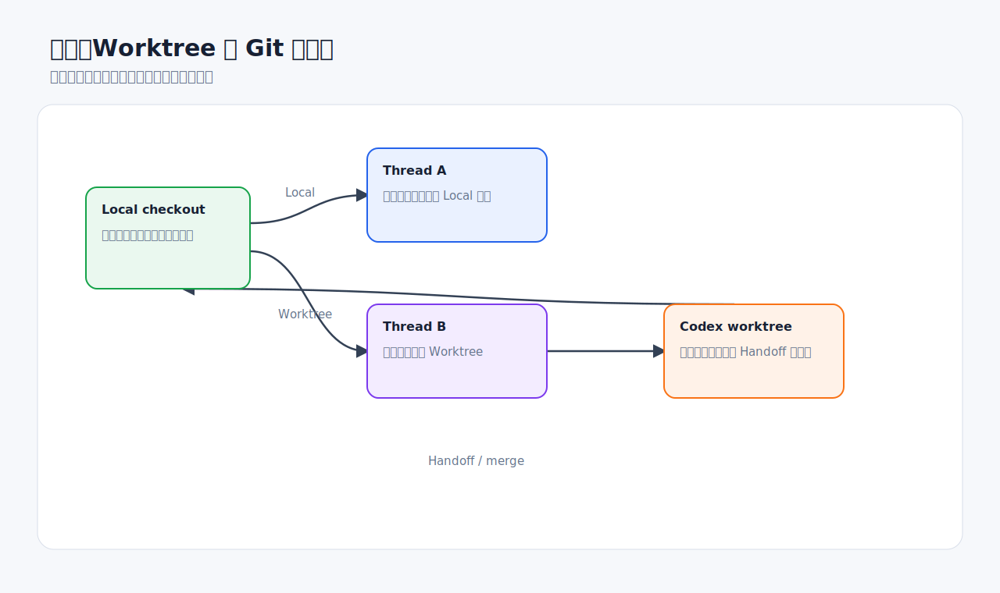
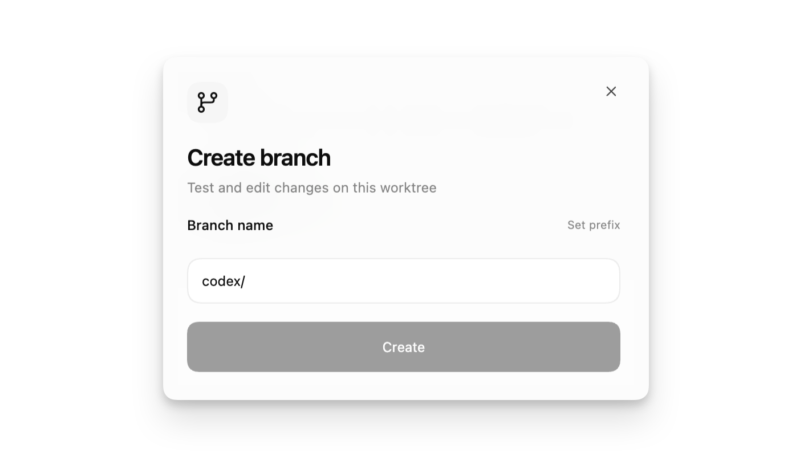
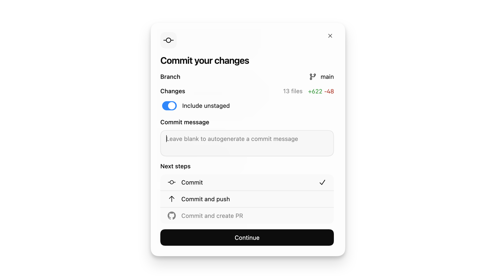

# Git 与并行工作流

Codex Desktop 的一个核心价值是把线程、diff、Git 和 Worktree 放在同一个工作流里。你可以让 Codex 在本地目录直接工作，也可以让它在隔离的 Git worktree 中尝试方案。



## Local 与 Worktree 的区别

| 模式 | 工作位置 | 适合场景 | 风险 |
| --- | --- | --- | --- |
| Local | 当前项目目录 | 小改、只读分析、明确修复 | 会直接影响你的当前工作区 |
| Worktree | Codex 管理的隔离检出 | 并行任务、探索方案、自动化 | 需要理解如何合并或 handoff |

官方文档说明，Codex app 中的 worktree 基于 Git worktree。它让同一仓库可以有多个检出，每个检出有自己的文件副本，但共享同一份 Git 元数据。

## 什么时候优先用 Worktree



优先使用 Worktree：

- 当前 Local 里有未提交改动。
- 要尝试不确定方案。
- 要让多个 Codex 线程并行工作。
- 要运行自动化任务。
- 任务可能改动较多文件。
- 你希望先看结果再决定是否移回本地。

可以使用 Local：

- 只读解释代码。
- 修改一个明确小问题。
- 文档或配置小修。
- 当前工作区干净且你准备马上审查。

## 开始前先看 Git 状态

推荐让 Codex 在修改前检查：

```text
开始前请先检查 git status。
如果当前工作区有未提交改动，请告诉我并建议使用 Worktree，不要直接修改。
```

如果是你自己在终端检查：

```powershell
git status
```

看三类信息：

- 是否有未提交改动。
- 当前分支是否正确。
- 是否有未跟踪文件可能被误提交。

## 从 Worktree 到 Local

Worktree 适合“先隔离试做”。当结果满意后，有几种收尾方式：

- 让 Codex 创建补丁或提交。
- 使用 Handoff 把线程从 Worktree 移回 Local。
- 手工 cherry-pick 或合并。
- 如果结果不满意，直接丢弃该线程或 worktree。

推荐提示词：

```text
请总结当前 Worktree 中的改动。
请说明：
1. 改了哪些文件；
2. 是否有测试通过；
3. 是否适合 handoff 到 Local；
4. 是否存在与 Local 未提交改动冲突的风险。
暂时不要执行 handoff。
```

## 从 diff 到提交或 PR



提交前建议走这条链路：

1. Review 面板看 diff。
2. 运行测试、lint 或构建。
3. 让 Codex 审查自己的改动。
4. 确认没有无关文件。
5. 暂存目标文件。
6. 写清晰 commit message。
7. 需要时 push 并创建 PR。

提交信息模板：

```text
fix(settings): prevent mobile toolbar overflow

- allow settings toolbar actions to wrap on narrow screens
- preserve desktop spacing
- add regression coverage for mobile layout
```

PR 描述模板：

```markdown
## Summary
- 修复设置页移动端按钮溢出
- 保持桌面布局不变

## Verification
- npm test
- npm run lint
- 手动检查 /settings 390px 和桌面宽度

## Risk
- 未在真实设备上验证，仅浏览器视口检查
```

## 并行线程的管理建议

- 每个线程只做一个目标。
- 给线程标题写清楚任务，例如“修复设置页移动端布局”。
- 不要让多个线程同时修改同一文件，除非你准备处理冲突。
- 并行任务结束后先合并最小、最确定的改动。
- 对大型任务，先让多个线程分别调研，再开一个主线程汇总方案。

## 自动化与 Worktree

官方资料说明，Git 仓库里的自动化任务可以在专用后台 worktree 中运行，这样可以降低和你当前 Local 工作互相影响的概率。非 Git 项目则可能直接在项目目录运行。

自动化任务要特别注意：

- 默认沙箱设置会影响自动化能力。
- 后台任务无人值守，权限不宜过宽。
- 首次几次运行要人工看结果。
- 自动化产生的 diff 也必须审查。

## 常见错误

**错误：多个线程同时改同一个文件。**  
更好的做法：拆分任务，或先让线程只读分析，再由一个线程实施。

**错误：Local 有未提交改动时直接让 Codex 大改。**  
更好的做法：先提交、stash，或改用 Worktree。

**错误：PR 描述只写“update”。**  
更好的做法：写清改动、验证和风险。

**错误：把生成文件、缓存文件一起提交。**  
更好的做法：提交前看文件列表，必要时更新 `.gitignore`。

## 好物推荐：Git、PR 和并行任务

Git 工作流的提效重点是：减少上下文搬运、隔离风险、让 PR 描述和验证证据自动成形。

| 推荐 | 类型 | 提升点 | 适合场景 |
| --- | --- | --- | --- |
| GitHub MCP / GitHub 集成 | MCP / App | 读取 issue、PR、CI、review comment，减少复制粘贴 | GitHub 团队协作 |
| Worktree | Codex app 功能 | 并行探索、隔离改动、降低污染本地工作区风险 | 多线程任务、大改、自动化 |
| release-notes skill | 自定义 Skill | 从 commit/PR 生成变更说明 | 发版、周报、交付说明 |
| pr-description skill | 自定义 Skill | 固定 Summary、Verification、Risk 格式 | 高频提交 PR |
| Codex Security 插件 | Plugin | PR 合并前做安全审查 | 认证、支付、用户数据、权限变更 |
| Linear / Slack 插件或 MCP | App / MCP | 把 issue、讨论和 PR 关联起来 | 产品和研发协作紧密的团队 |

值得自制的 Git 类 Skill：

- **branch-hygiene**：提交前检查 `git status`、无关文件、锁文件、生成文件。
- **pr-description**：从 diff 和测试输出生成 PR 描述。
- **release-notes**：按用户可感知变化生成 changelog。
- **conflict-analysis**：合并前分析冲突风险和改动重叠。

推荐提示词：

```text
请使用 GitHub 上下文读取当前 PR 和关联 issue。
不要发表评论或推送代码。
请先总结用户需求、当前 diff、CI 状态和还缺哪些验证。
```

不建议：

- 为了省事让 Codex 自动 push 未审查 diff。
- 多个线程同时改同一个核心文件。
- 让自动化任务直接在 Local 上改正在开发中的分支。

## 检查清单

- [ ] 修改前检查过 `git status`。
- [ ] 大改或并行任务使用 Worktree。
- [ ] 每个线程目标独立。
- [ ] 提交前看过 diff。
- [ ] 提交前运行过验证或说明原因。
- [ ] PR 描述包含 Summary、Verification、Risk。

## 官方参考

- [Codex app worktrees](https://developers.openai.com/codex/app/worktrees)
- [Codex app features](https://developers.openai.com/codex/app/features)
- [Codex app review](https://developers.openai.com/codex/app/review)
- [Codex app automations](https://developers.openai.com/codex/app/automations)
