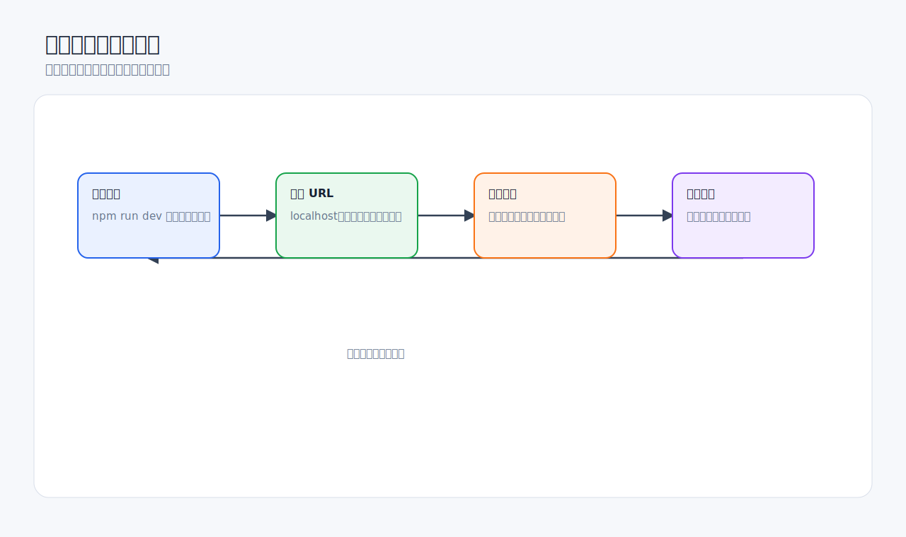

# 浏览器预览与前端调试

Codex Desktop 的 in-app browser 适合你和 Codex 共同查看页面渲染结果：本地开发服务器、静态预览、无需登录的公开页面。它特别适合前端布局、视觉反馈和交互状态验证。



## 适合场景

- 预览 `localhost` 页面。
- 检查响应式布局、空状态、错误状态、加载状态。
- 用截图或标注告诉 Codex “这里不对”。
- 让 Codex 修改 CSS 后刷新页面复查。
- 文档、报表、HTML 原型的视觉检查。

不适合场景：

- 需要登录态、Cookie、浏览器扩展或个人 Chrome Profile 的页面。
- 需要在真实账号里提交表单的流程。
- 需要访问密码管理器、支付、身份验证等敏感流程。

官方文档明确说明，in-app browser 不支持认证流程、登录页面、常规浏览器 Profile、Cookie、扩展或已有标签页。遇到这类需求，应考虑 Chrome 插件或其他经过授权的工具，并谨慎处理敏感数据。

## 打开本地页面


推荐流程：

1. 让 Codex 识别项目启动命令。
2. 启动或检查开发服务器。
3. 打开明确 URL，例如 `http://localhost:3000/settings`。
4. 指定你关心的状态：桌面、移动端、加载中、空数据、错误提示。
5. 让 Codex 根据渲染结果做小范围修改。
6. 刷新页面再次验证。

提示词：

```text
请先检查这个前端项目的启动命令。
如果 dev server 没启动，请启动它。
然后用内置浏览器打开 http://localhost:3000/settings。
重点检查 390px 移动宽度下按钮是否溢出。
不要处理无关页面。
```

## 使用 Annotation 精确反馈

视觉问题最怕描述模糊。不要只说“这里不好看”，最好框选具体元素或区域，并写明当前状态和期望状态。


好的评论：

```text
这个按钮在 390px 宽度下被右侧边界裁切。期望它换行或缩小间距，不要横向滚动。
```

```text
错误提示和输入框距离太近，读起来像同一行内容。期望错误提示在输入框下方保留 8px 以上间距。
```

不好的评论：

```text
这里怪怪的。
```

```text
优化一下这个页面。
```

## 前端视觉反馈闭环


建议每轮只修一个视觉问题：

1. **发现**：截图或标注问题区域。
2. **定位**：让 Codex 找到对应组件和样式。
3. **修复**：只改相关样式或组件。
4. **验证**：刷新同一个 URL，在同样视口下检查。
5. **记录**：最终说明写清问题、改动和验证。

提示词：

```text
请根据我在浏览器里标注的区域修复布局问题。
要求：
- 只修这个标注区域；
- 不重写整个页面；
- 保持桌面端布局不变；
- 修改后刷新同一路由验证；
- 最终说明修改文件和验证结果。
```

## 多视口检查

前端 UI 至少检查：

- 移动窄屏：约 360-430px。
- 平板或中等宽度：约 768px。
- 桌面：约 1280px 以上。
- 内容最长情况：长用户名、长标题、长按钮文字。
- 空状态和错误状态。
- 加载中状态。

如果 Codex 无法直接调整视口，你可以要求它说明如何检查，或让它通过 CSS 和组件逻辑分析潜在问题。

## 常见问题

**页面打不开。**  
让 Codex 检查 dev server 是否启动、端口是否正确、控制台是否报错。

```text
页面打不开。请检查开发服务器状态、端口和启动日志。
不要修改代码，先告诉我原因。
```

**页面需要登录。**  
不要把账号密码粘贴进 in-app browser。改用 mock 数据、本地开发登录方式，或通过授权的 Chrome/Connector 流程处理。

**Codex 修了太多 CSS。**  
要求它回到最小修改：

```text
这次改动范围过大。请重新审查 diff，只保留解决标注问题所需的最小样式改动。
```

**视觉问题反复出现。**  
把复现条件写具体：路由、视口、状态、数据长度、浏览器缩放、主题模式。

## 好物推荐：前端和浏览器效率栈

前端提效最明显的组合不是单个工具，而是“设计上下文 + 本地预览 + 视觉反馈 + 项目规则”。

| 推荐 | 类型 | 提升什么效率 | 什么时候用 |
| --- | --- | --- | --- |
| in-app browser | Codex app 内置 | 预览 localhost、静态页面、公开页面，不动用个人浏览器资料 | 默认首选 |
| Browser 插件 | Plugin | 让 Codex 打开、检查、截图、验证本地页面 | 前端修改后的自动验证 |
| Figma MCP | MCP | 读取设计稿、组件、视觉目标和设计系统上下文 | 从设计稿实现 UI |
| Chrome 插件 | Plugin | 使用已登录网站、Cookie、扩展和真实 Chrome Profile | CRM、Gmail、内部系统、登录态页面 |
| imagegen skill | Skill | 生成教程配图、占位图、视觉素材、海报背景 | 文档、营销页、演示稿 |
| frontend-visual-qa skill | 自定义 Skill | 固定检查视口、长文本、空状态、错误态、按钮溢出 | 高频做前端 QA |

推荐安装顺序：

1. **先用 in-app browser**：本地页面和公开页面足够用，隐私面最小。
2. **再接 Figma MCP**：如果你的工作经常从设计稿开始。
3. **最后接 Chrome**：只有登录态、扩展、真实浏览器历史确实必要时再用。

前端自制 Skill 模板：

```text
frontend-visual-qa:
- 检查桌面、平板、移动端；
- 检查 loading、empty、error、long-content 状态；
- 检查按钮、表单、卡片、导航是否溢出；
- 每次修改后用浏览器复查同一路由；
- 最终输出截图观察、改动文件和验证结果。
```

不建议：

- 能用 in-app browser 的 localhost 页面直接用 Chrome。
- 没有设计稿上下文时让 Codex “照 Figma 风格做”。
- 一次让 Codex 重写整站视觉系统；先让它修一个可验证问题。

## 检查清单

- [ ] 已启动或确认 dev server。
- [ ] URL 明确。
- [ ] 状态明确：加载、空、错误、普通数据。
- [ ] 使用 Annotation 或截图定位问题。
- [ ] 修改后在同一路由复查。
- [ ] 关键页面至少检查移动端和桌面端。
- [ ] 最终说明包含验证路径。

## 官方参考

- [In-app browser](https://developers.openai.com/codex/app/browser)
- [Codex app features](https://developers.openai.com/codex/app/features)
- [Chrome extension](https://developers.openai.com/codex/app/chrome-extension)
- [Computer Use](https://developers.openai.com/codex/app/computer-use)
