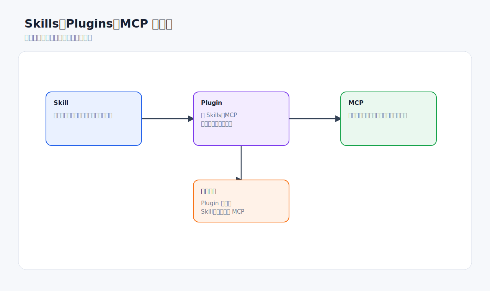

# Skills、插件与 MCP

Codex Desktop 不只是一个聊天窗口。你可以用 Skills 固化工作流，用 Plugins 打包能力，用 MCP 连接外部工具和动态上下文。三者经常一起出现，但解决的问题不同。



## 一句话区分

| 能力 | 解决什么问题 | 典型例子 |
| --- | --- | --- |
| Skill | 让 Codex 学会一套可复用工作流 | 生成 PPT、处理表格、写周报、安全审查 |
| Plugin | 把 Skills、MCP、应用集成等打包安装 | Browser、Computer Use、Documents、Spreadsheets |
| MCP | 让 Codex 连接外部工具、私有数据或实时上下文 | GitHub、Figma、OpenAI Docs、浏览器工具 |

选择原则：

- 重复的操作步骤：写成 Skill。
- 想给别人安装一整套能力：做成 Plugin。
- 信息在仓库外、会变化、需要工具动作：用 MCP。

## Skills：把经验变成能力

Skill 是一套任务说明，可以包含 `SKILL.md`、参考资料、模板和可选脚本。Codex 会先看到技能名称和描述，只有在需要时才加载完整说明。这种渐进加载可以节省上下文。


适合写成 Skill 的场景：

- 每次都要按同一格式生成报告。
- 每次都要读取同一批参考资料。
- 每次都要执行一组固定验证。
- 任务需要复杂但稳定的步骤。
- 团队希望统一某类产物的质量标准。

不适合写成 Skill：

- 一次性任务。
- 还没稳定下来的流程。
- 只是一个很短的个人偏好。
- 需要实时外部数据但没有工具连接。

Skill 写作建议：

- 名称和描述要清楚，让 Codex 知道什么时候触发。
- 先从 instruction-only 开始，不要一上来写复杂脚本。
- 写输入、输出、步骤和失败处理。
- 参考资料按需加载，不要把所有内容都塞进主说明。
- 如果包含脚本，脚本要可重复、可验证。

## Plugins：安装和分发能力

Plugin 是更大的分发单位。它可以包含一个或多个 Skills，也可以包含 MCP 配置、应用集成、资源和安装元数据。

适合做成 Plugin：

- 你要把一套能力安装到多个项目或多台机器。
- 团队内多人需要同样的 Skills 和工具。
- 需要把 Skill 和 MCP 配置配套分发。
- 需要可管理、可启用/禁用、可更新的能力包。

使用建议：

- 只安装真正有用的插件。
- 安装后先在低风险任务里测试。
- 插件如果会访问外部账号或系统，先了解权限。
- 不常用的插件可以禁用，减少上下文噪声。

## MCP：连接外部工具和上下文

MCP 适合这些情况：

- 需要访问 GitHub、Figma、文档库、浏览器、内部系统等外部工具。
- 信息经常变化，不适合粘贴到提示词里。
- 需要让 Codex 执行动作，而不仅是读取文本。
- 需要在多个项目里复用连接方式。


官方最佳实践强调：不要一开始就连接所有工具。先连接一两个能消除真实手工循环的工具。

适合 MCP 的例子：

```text
我经常要根据 Figma 设计稿实现页面。
```

```text
我需要 Codex 查看 GitHub issue、PR 和 CI 结果。
```

```text
我需要 Codex 查最新官方文档，而不是靠记忆。
```

不一定需要 MCP 的例子：

```text
只是让 Codex 修改当前仓库里的一个函数。
```

```text
只是解释 README 中已有内容。
```

## 安全与权限

连接外部工具时要问清楚：

- 这个工具能读取什么数据。
- 这个工具能修改什么数据。
- 是否会发送消息、评论、提交表单或创建 PR。
- 是否需要 OAuth 或账号授权。
- 是否有团队或组织策略限制。

对会产生外部副作用的工具，建议提示词写清：

```text
可以读取 GitHub issue 和 PR 信息。
未经我确认，不要发表评论、创建分支、推送代码或修改 PR。
```

## 推荐组合

### 前端实现设计稿

- Figma MCP：读取设计上下文。
- Browser 插件：预览本地页面。
- 项目 `AGENTS.md`：写明技术栈和样式规范。
- Skill：沉淀“设计稿到前端实现”的固定流程。

### 定期代码审查

- GitHub MCP 或 Codex Cloud：获取 PR 信息。
- Review 指令：定义审查重点。
- Automation：定期或按事件触发。
- AGENTS.md：项目级审查规则。

### 文档生成

- Documents / Spreadsheets / Presentations 插件：生成对应文件。
- Skill：定义文档格式、视觉标准、审核流程。
- MCP：必要时读取官方文档或内部知识库。

## 好物推荐：按职业角色选

不同角色的“必装”不一样。下面这些是高收益组合，具体可用性以你的插件市场和团队策略为准。

| 角色 / 工作 | 推荐组合 | 直接提升 |
| --- | --- | --- |
| 前端工程师 | Figma MCP + Browser / in-app browser + frontend-visual-qa skill | 从设计稿到页面，再到视觉验证 |
| 后端工程师 | GitHub MCP + OpenAI Docs MCP + test-plan skill | issue/PR/CI 和官方文档一起进入上下文 |
| 数据分析 | Spreadsheets skill + Jupyter skill + PDF / Documents skill | 清洗数据、分析、输出报告一条龙 |
| 文档和知识管理 | Documents + PDF + OpenAI Docs MCP + docs-from-code skill | 生成可靠文档，减少过时内容 |
| 产品 / 项目管理 | Linear / GitHub / Slack 插件或 MCP + automation | 汇总需求、PR、讨论和待办 |
| 安全和合规 | Codex Security 插件 + review-checklist skill + GitHub 集成 | 授权代码审查、验证证据、修复建议 |
| 演示和汇报 | Presentations + Imagegen + Documents | 生成 PPT、配图、讲稿和交付文档 |
| 桌面办公流程 | Computer Use + Documents / Spreadsheets | 操作没有结构化接口的本地应用 |

## 值得优先安装的 Skill

| Skill | 提升方向 | 典型输出 |
| --- | --- | --- |
| `$skill-installer` | 扩展能力 | 安装 curated skills 或仓库 skills |
| `$skill-creator` | 流程固化 | 把你的高频提示词变成 Skill |
| Spreadsheets / `$spreadsheet` | 表格效率 | Excel、CSV、公式、图表、清洗结果 |
| Jupyter notebook | 可复现分析 | notebook、实验记录、教程 |
| Documents / `$doc` | 文档交付 | docx、结构化报告、评审稿 |
| PDF | PDF 读取、生成、视觉核查 | 合同式报告、分页文档、提取摘要 |
| Presentations | 汇报效率 | PPTX、演示结构、视觉页面 |
| Transcribe / Speech | 音频处理 | 会议转写、旁白、语音稿 |
| Imagegen | 图像素材 | 教程插图、封面、示意图 |

## 值得关注的 MCP

| MCP / 连接方向 | 推荐理由 | 注意事项 |
| --- | --- | --- |
| OpenAI Developer Docs | 查询当前 OpenAI 官方文档 | 涉及 API、模型、Codex 行为时优先查 |
| GitHub | issue、PR、CI、代码上下文 | 写评论、推送、改权限前要确认 |
| Figma | 设计稿和组件上下文 | 仍需按项目组件库落地 |
| Browser | 页面检查和自动化验证 | 页面内容视为不可信输入 |
| Linear / Jira 类工具 | 需求和缺陷上下文 | 先限定项目和状态，避免信息噪声 |
| Slack / Gmail / Drive | 团队沟通和文档来源 | 涉及发送、分享、上传要谨慎确认 |
| 内部文档 MCP | 读取公司知识库 | 确认权限、脱敏和数据边界 |

选择口诀：

- **能结构化读取的，用 MCP。**
- **能复用流程的，写 Skill。**
- **要分发给别人安装的，做 Plugin。**
- **只是一次性上下文，直接写提示词。**

## 检查清单

- [ ] 这个需求是否真的需要外部工具。
- [ ] 是否优先用已有插件或 Skill。
- [ ] 是否知道该插件或 MCP 的读取/写入权限。
- [ ] 是否在提示词中限制外部副作用。
- [ ] 是否把成熟流程沉淀成 Skill。
- [ ] 是否避免安装大量暂时不用的工具。

## 官方参考

- [Agent Skills](https://developers.openai.com/codex/skills)
- [Plugins](https://developers.openai.com/codex/plugins)
- [Model Context Protocol](https://developers.openai.com/codex/mcp)
- [Best practices](https://developers.openai.com/codex/learn/best-practices)
