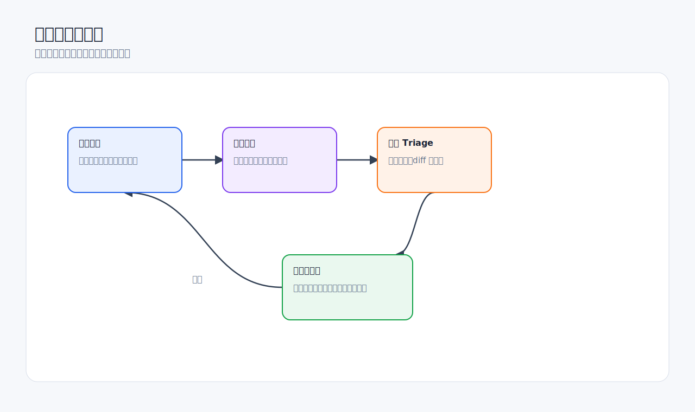
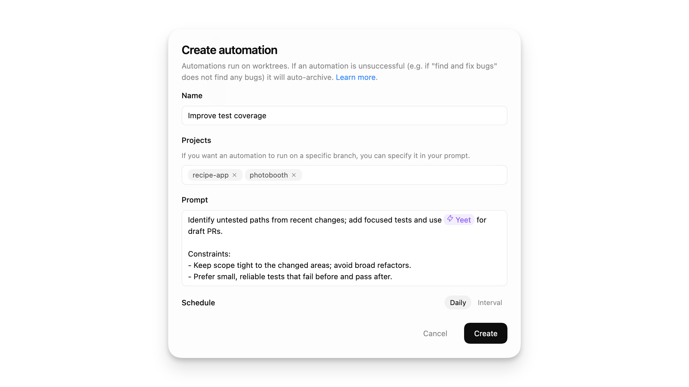
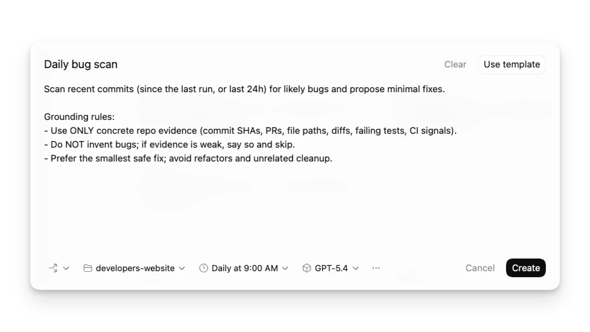

# 自动化与长期任务

自动化适合把稳定、重复、范围清楚的任务交给 Codex 定期运行。它不是“让 Codex 自动做所有事”，而是把固定工作流变成可审查的后台任务。



## 适合自动化的任务

- 定期检查测试失败并总结原因。
- 每天查看依赖更新或安全公告。
- 定期生成项目状态摘要。
- 监控某个 PR、issue、部署或长时间运行的命令。
- 在当前线程里定时提醒继续检查结果。

不适合自动化：

- 目标模糊的“帮我优化项目”。
- 需要频繁人工判断的大改。
- 需要高权限、删除数据、上传敏感文件的任务。
- 首次尝试、尚未稳定的流程。

## 创建自动化前先写清楚 5 件事



| 要素 | 说明 |
| --- | --- |
| 任务 | 每次运行到底要做什么 |
| 范围 | 哪个项目、分支、路径、页面或外部来源 |
| 频率 | 何时运行，是否需要重复 |
| 权限 | 是否允许修改文件、联网、使用工具 |
| 输出 | 输出到哪里，如何让你审查 |

示例：

```text
请创建一个自动化任务：
每天上午 9 点检查这个项目 main 分支最近一次测试失败原因。

要求：
- 只读取日志和当前仓库，不自动提交代码；
- 如果发现失败，输出摘要、可能根因和建议下一步；
- 如果需要修改代码，只提出建议，不直接改；
- 结果进入 Triage，方便我人工审查。
```

## Thread automation 与项目自动化

Thread automation 适合保留当前对话上下文：

- 等待一个长命令完成。
- 定时检查某个正在讨论的 PR。
- 继续当前研究或审查循环。
- 在同一线程里持续跟踪一个问题。

项目级或独立自动化适合每次运行相对独立：

- 每周生成项目报告。
- 每天检查依赖。
- 定期扫描某些目录。
- 多项目重复任务。

选择原则：

- 需要延续当前对话，就用 thread automation。
- 每次都可以从固定提示词开始，就用独立或项目自动化。

## Triage：把结果当作待办箱

自动化结果会进入类似 inbox 的处理流。不要把它当成自动合并入口。



处理顺序：

1. 先看未读和失败项。
2. 打开自动化运行记录。
3. 查看它读取了什么、输出了什么、是否产生 diff。
4. 如果产生改动，照常走 Review 和测试。
5. 如果输出太吵，收紧自动化提示词。
6. 如果经常漏报，补充范围或接入必要工具。

## 自动化提示词要耐久

自动化的提示词不能依赖“上面那段话”或“刚才那个文件”。它要像一个独立任务说明，几天后仍然能读懂。

不推荐：

```text
以后每天帮我查一下这个。
```

推荐：

```text
每天上午 9 点，在当前项目中检查前端测试是否失败。
范围：只检查 package.json 中定义的 test 命令和最近一次测试输出。
输出：用中文列出失败测试、可能原因和建议下一步。
限制：不要修改文件，不要提交代码。
```

## 权限与风险

官方资料说明，自动化会使用默认沙箱设置。后台任务无人值守，所以权限越宽，风险越高。

建议：

- 首次自动化从只读开始。
- 前几次运行都人工审查。
- Git 仓库优先使用 worktree 隔离。
- 不要让自动化默认拥有全权限。
- 对会修改文件的自动化，要求输出 diff 并等待人工确认。

## 把自动化和 Skill 结合

如果某个自动化流程越来越固定，可以把核心流程写成 Skill，再让自动化调用该 Skill 的工作方式。

例子：

- “每周生成发布报告” Skill。
- “PR 安全审查” Skill。
- “依赖升级影响分析” Skill。
- “截图验证前端页面” Skill。

好处：

- 自动化提示词更短。
- 流程更容易复用。
- 团队可以统一标准。
- 后续修改 Skill 即可影响多个任务。

## 好物推荐：值得自动化的工作流

自动化最适合“稳定、有证据、可审查”的任务。下面这些比“每天帮我看看项目”更值得做。

| 自动化 | 推荐组合 | 提升点 | 风险控制 |
| --- | --- | --- | --- |
| 每日测试失败摘要 | Automation + test-plan skill + GitHub/CI MCP | 自动收集失败、定位可能原因 | 默认只读，不自动修 |
| PR 待审提醒 | Thread automation + GitHub MCP + review-checklist skill | 定时检查 PR 状态和评论 | 不自动发表评论 |
| 依赖更新观察 | Automation + OpenAI Docs/包管理文档 MCP | 汇总可疑升级和破坏性变化 | 不自动升级生产依赖 |
| 设计稿变更巡检 | Automation + Figma MCP + frontend-visual-qa skill | 提醒设计变更影响哪些页面 | 只输出影响分析 |
| 周报 / 发布摘要 | Automation + GitHub/Linear/Slack + release-notes skill | 自动汇总本周完成和风险 | 人工审查后再发送 |
| 数据报表生成 | Automation + Spreadsheets/Jupyter + Documents/PDF | 定期生成报告草稿 | 数据源和输出位置要固定 |

最推荐先做的 3 个：

1. **只读 PR/CI 摘要**：风险低，马上省时间。
2. **每周 release-notes 草稿**：输出可人工编辑，不会直接影响代码。
3. **长期线程提醒**：比如“30 分钟后检查构建是否完成”，适合 thread automation。

不建议自动化：

- 自动删除、自动上传、自动发邮件、自动改权限。
- 自动接受 PR review 或自动合并。
- 未经人工确认的生产环境操作。
- 目标不断变化、每次都需要重新判断的任务。

自动化提示词里可以显式触发 Skill：

```text
每周五 17:00 使用 $release-notes 工作流生成本周发布摘要。
只读取 GitHub PR 和 Linear issue，不发送消息、不创建 PR。
输出 Summary、Verification、Risk 三段，进入 Triage 等我审查。
```

## 检查清单

- [ ] 任务是否稳定、重复、范围明确。
- [ ] 提示词是否脱离当前对话也能读懂。
- [ ] 是否明确禁止不需要的写入、提交或外部动作。
- [ ] 是否决定使用 thread automation 还是项目自动化。
- [ ] 前几次运行是否会人工审查。
- [ ] 自动化输出是否进入可追踪位置。

## 官方参考

- [Codex app automations](https://developers.openai.com/codex/app/automations)
- [Codex app worktrees](https://developers.openai.com/codex/app/worktrees)
- [Codex app settings](https://developers.openai.com/codex/app/settings)
- [Agent Skills](https://developers.openai.com/codex/skills)
