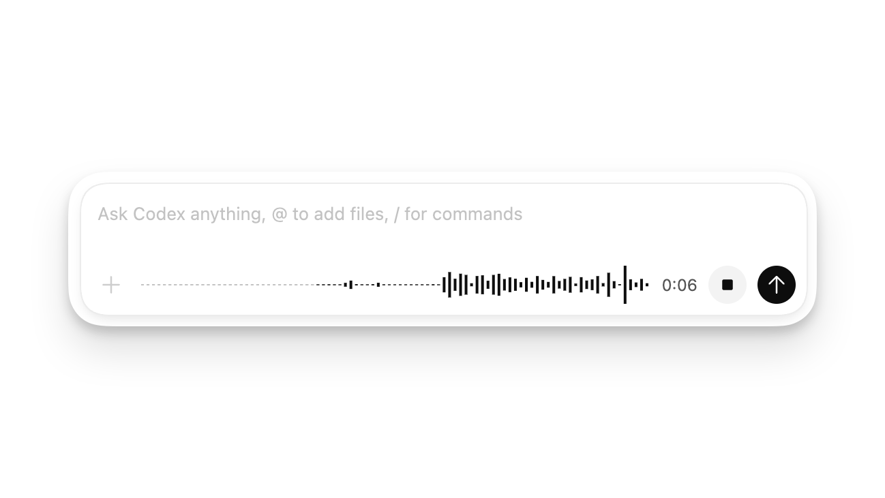

# Codex 桌面端设置详解

这篇是对整套文档的二轮补充。前 10 篇已经覆盖了入门、提示词、AGENTS.md、审查、Git、浏览器、Skills / Plugins / MCP、自动化、Windows 和安全，但对 **Codex Desktop Settings** 的系统介绍还不够完整。本篇专门补齐设置项、快捷入口和容易遗漏的桌面端技巧。

如果你需要更细的设置说明、截图化阅读路径，以及 Codex 订阅、Credits、Rate Card、Business / Enterprise 管理和省额度策略，请阅读专题版：[专题-Codex桌面端设置与计费规则](专题-Codex桌面端设置与计费规则/README.md)。


## 设置总览

Codex Desktop 的 Settings 不只是换主题，它决定了 Codex 怎么打开文件、怎么显示命令输出、怎么发通知、怎么连接 MCP、怎么使用浏览器、怎么管理 Git、怎么继承 CLI / IDE 配置。

| 设置区域 | 主要作用 | 推荐关注人群 |
| --- | --- | --- |
| General | 文件打开方式、命令输出、终端标签、多行输入、阻止睡眠 | 所有人 |
| Profile | 使用统计、token 活动、个人资料和 profile card | 想了解使用量的人 |
| Keyboard Shortcuts | 查看、搜索、修改、重置快捷键 | 高频用户 |
| Notifications | 任务完成、等待批准时的通知策略 | 长任务和后台任务用户 |
| Agent configuration | 模型、权限、沙箱、网络、`config.toml` 等代理配置入口 | 需要稳定工作流的人 |
| Appearance | 主题、颜色、字体、Codex pets | 长时间使用桌面端的人 |
| Git | 分支命名、force push 策略、commit / PR 生成提示词 | 团队协作用户 |
| Integrations & MCP | 推荐 MCP、自定义 MCP、OAuth 授权 | 需要外部工具的人 |
| Browser use | Browser 插件、Chrome extension、允许/阻止的网站 | 前端和网页任务用户 |
| Computer Use | 桌面应用控制相关权限和偏好 | GUI 测试、桌面软件用户 |
| Personalization | Friendly / Pragmatic / None 和自定义个人指令 | 想控制 Codex 语气和习惯的人 |
| Context-aware suggestions | 返回 Codex 时提示可继续的任务 | 多线程、多项目用户 |
| Memories | 跨线程保留稳定偏好和经验 | 高频长期使用者 |
| Archived threads | 查看和恢复归档线程 | 需要整理历史线程的人 |

## General：先把基础体验调顺

General 是最值得第一天就检查的设置区。

建议关注：

- **Where files open**：设置 Codex 打开文件时使用 VS Code、Visual Studio 或其他编辑器。
- **Command output visibility**：控制命令输出在聊天里显示多少，避免长日志淹没对话。
- **Terminal tabs default**：设置终端标签默认打开位置。
- **Multiline prompts**：如果你经常写长提示词，可以要求使用快捷键确认多行输入，减少误发送。
- **Prevent sleep while running**：长任务、自动化、构建、测试时建议开启。

推荐设置：

| 使用习惯 | 建议 |
| --- | --- |
| 经常让 Codex 跑测试或构建 | 开启 Prevent sleep while running |
| 经常粘贴长提示词 | 开启多行输入确认 |
| 经常分析长日志 | 命令输出不要全部塞进线程，必要时让 Codex 摘要 |
| 经常跳到代码 | 设置默认编辑器，并按项目检查是否有覆盖 |

## Profile：看使用量和高峰任务

Profile 可以查看 activity insights、lifetime tokens、peak tokens、streaks、longest task 和 token activity，也可以更新头像、显示名、用户名，并保存带使用亮点的 profile card。

适合用来回答这些问题：

- 我最近是不是把 Codex 用在了很多长任务上。
- 哪类任务最消耗 token。
- 是否需要把常用流程做成 Skill 来减少重复上下文。
- 团队分享时是否需要使用 profile card。

不要把 Profile 当作质量指标。token 多不代表产出好，关键还是 diff 是否可审查、验证是否通过、风险是否讲清楚。

## Keyboard Shortcuts：高频用户的第一提效项

Settings > Keyboard Shortcuts 可以查看命令、修改绑定、重置默认快捷键，也可以用命令名搜索，或切到 keystroke search 后按下组合键反查命令。

官方命令页列出的高频快捷动作包括：

| 动作 | 用途 |
| --- | --- |
| Command menu | 快速打开命令、重载 Skills、唤起部分功能 |
| Settings | 打开设置 |
| Keyboard shortcuts | 管理快捷键 |
| Open folder | 打开项目目录 |
| Navigate back / forward | 在线程和界面间跳转 |
| Increase / decrease font size | 调整阅读舒适度 |
| Toggle sidebar | 收起或展开侧栏 |
| Toggle diff panel | 快速看改动 |
| Toggle terminal | 打开集成终端 |
| Clear terminal | 清理终端输出 |
| New thread | 快速新建线程 |
| Search threads | 搜索历史线程 |
| Find in thread | 在当前线程内搜索 |
| Dictation | 语音输入 |

Windows 上请以 Settings > Keyboard Shortcuts 中显示的实际绑定为准；不同平台和自定义绑定可能不同。

## Notifications：长任务别错过

Notifications 控制 turn completion notifications 出现的时机，以及是否提示系统通知权限。

推荐策略：

| 场景 | 建议 |
| --- | --- |
| 经常跑长测试或构建 | 打开后台完成通知 |
| 经常等待批准 | 打开需要批准时通知 |
| 只做短任务 | 可以减少通知或只在后台通知 |
| 直播、录屏、演示 | 临时关闭通知，避免泄露项目或线程标题 |

## Agent configuration：常用设置走 UI，高级设置进 config.toml

官方文档说明，Codex app、CLI、IDE Extension 会继承同一套 agent configuration。常用设置可以在 app 内调，高级选项则编辑 `config.toml`。

建议优先在 UI 中确认：

- 默认模型和推理强度。
- 沙箱权限。
- 批准策略。
- 网络访问和 web search 行为。
- MCP servers。
- Rules / Hooks 等高级策略是否由配置控制。

什么时候编辑 `config.toml`：

- 需要跨 CLI、IDE、App 统一配置。
- 需要配置 MCP、网络策略、沙箱、规则、hooks。
- 需要团队可复制的配置。
- 需要启用某些 feature flag，例如 goal mode。

不要把临时任务约束写进全局配置。一次性的“本次不要改文件”应该写在提示词里；长期偏好才进入配置或 AGENTS.md。

## Appearance：主题、字体和 Pets

Appearance 可以设置 base theme、accent color、background、foreground、UI font、code font，也可以分享自定义主题。

推荐：

- 长时间写代码：选择对比度舒服的主题和等宽代码字体。
- 做截图教程：用浅色主题，便于截图在 Markdown 中阅读。
- 经常录屏：减少过强的个性化颜色，避免分散注意力。

### Codex pets

Codex pets 是可选动画伴随界面。它能用浮层显示当前线程状态，例如正在运行、等待输入、等待审查。你可以在 Appearance > Pets 选择内置 pet，或刷新本地 Codex home 中的自定义 pets。

如果想自制 pet，官方文档建议安装 `hatch-pet` skill：

```text
$skill-installer hatch-pet
```

适合：

- 希望在别的应用中也能看到 Codex 任务状态。
- 长任务较多，想快速知道是否需要回到线程。

不适合：

- 正式演示、录屏、直播。
- 极简工作区。
- 不希望界面有动画干扰。

## Git：把提交和 PR 风格固定下来

Git 设置可以标准化分支命名，选择 Codex 是否使用 force push，还可以设置 Codex 生成 commit message 和 PR description 时使用的提示词。

推荐配置：

| 项目 | 建议 |
| --- | --- |
| Branch naming | 团队统一前缀，例如 `feature/`、`fix/`、`codex/` |
| Force push | 默认关闭；只有明确需要整理远端分支时才允许 |
| Commit prompt | 要求动词清晰、scope 清晰、不要夸大 |
| PR prompt | 固定 Summary、Verification、Risk |

PR prompt 示例：

```text
Generate a concise PR description with:
1. Summary
2. Verification
3. Risk
Mention exact commands that were run. Do not claim tests passed unless they were run successfully.
```

## Integrations & MCP：把外部上下文接进来

Integrations & MCP 用来启用推荐 MCP server 或添加自定义 server。如果 server 需要 OAuth，Codex app 会启动授权流程。MCP 配置写在 `config.toml`，因此 app、CLI、IDE Extension 可以共享。

推荐原则：

- 优先安装能减少真实手工复制的 MCP。
- 不要一开始接所有工具。
- 需要读私有数据的 MCP，要确认权限范围。
- 会写外部系统的 MCP，要在提示词里禁止未确认的写入动作。

值得优先考虑：

- GitHub：issue、PR、CI、review 上下文。
- Figma：设计稿和组件上下文。
- OpenAI Developer Docs：核对 OpenAI 官方文档。
- Browser：本地页面检查和可视化验证。
- Linear / Jira：需求和缺陷上下文。
- Slack / Gmail / Drive：团队沟通和文档来源，但要谨慎处理发送、分享、上传。

## Browser use：区分 in-app browser、Browser 插件和 Chrome

Browser use 设置可以安装或启用 bundled Browser plugin，设置 Codex Chrome extension，并管理 allowed / blocked websites。

| 工具 | 适合 | 不适合 |
| --- | --- | --- |
| in-app browser | localhost、静态页面、无需登录公开页面 | 登录态、Cookie、扩展、个人浏览器 Profile |
| Browser plugin | 让 Codex 操作本地开发服务器和文件预览页面 | 敏感网站、登录态流程 |
| Chrome extension | 需要真实 Chrome 登录态和扩展 | 能用 in-app browser 解决的本地页面 |

建议：

- localhost 优先用 in-app browser。
- 需要 Codex 操作页面时再启用 Browser plugin。
- 只有登录态确实必要时才使用 Chrome extension。
- 定期清理 allowed websites 和 blocked websites。

## Computer Use：强但要窄

Computer Use 可以让 Codex 操作 macOS 或 Windows 应用，适合没有插件、MCP、API 的 GUI-only 场景。


官方文档说明，Computer Use 在 macOS 和 Windows 可用，但在 EEA、英国和瑞士发布初期不可用。Windows 上它运行在当前活动桌面，会接管前台输入；macOS locked use 是单独能力，不应套用到 Windows。

适合：

- 桌面应用测试。
- 复现 GUI-only bug。
- 操作没有结构化接口的数据源。
- 检查模拟器、浏览器或桌面软件界面。

不适合：

- 有专用 MCP / 插件 / API 的任务。
- 密码管理器、安全设置、支付、验证码。
- 宽泛地“帮我操作电脑”。

每次使用前问清：

```text
这次 Computer Use 只允许操作哪个应用？
目标是什么？
哪些按钮或动作禁止点击？
是否会发送、上传、删除或保存数据？
```

## Personalization：控制 Codex 的默认风格

Personalization 可以选择 Friendly、Pragmatic 或 None。

| 选项 | 适合 |
| --- | --- |
| Friendly | 希望 Codex 解释更自然、有陪伴感 |
| Pragmatic | 希望更直接、工程化、少闲聊 |
| None | 希望关闭个性化风格，只保留任务本身 |

你也可以添加自定义指令。官方文档说明，编辑自定义指令会更新你的个人 `AGENTS.md`。因此，不要把项目临时约束、密钥、账号信息放进个人自定义指令。

## Context-aware suggestions

Context-aware suggestions 会在你启动或回到 Codex 时，提示可能想继续的任务或 follow-up。

适合：

- 同时维护多个项目。
- 经常中断后回来继续。
- 有多个长期 thread 或 automation。

不适合：

- 希望界面尽量安静。
- 不想让历史任务影响当前思路。

## Memories：只存稳定偏好

Memories 可用时，可以让 Codex 从过去任务中带入有用上下文。

适合存：

- 稳定个人偏好。
- 常用技术栈。
- 长期项目约定。
- 经常重复的工作模式。

不适合存：

- 密钥、token、账号。
- 一次性任务目标。
- 临时分支名。
- 已经过期的项目事实。

建议每隔一段时间审查 Memories，删除过时或不希望保留的内容。

## Archived threads

Archived threads 会列出已归档线程、日期和项目上下文，并允许 Unarchive。

使用建议：

- 完成的线程及时归档，保持侧栏清爽。
- 重要线程先 pin，再归档前确认是否还需要 worktree。
- 需要复盘时从 Archived threads 找回。

## Local environments：设置 Worktree 初始化和快捷动作

Local environments 是此前文档遗漏较多的重点。它可以配置 worktree setup steps 和项目常用 actions。


### Setup scripts

Worktree 通常在不同目录中运行，可能缺依赖、构建产物或本地文件。Setup scripts 会在 Codex 创建新 worktree、开始新线程时自动运行。

适合写入：

```text
npm install
npm run build
```

或：

```text
pnpm install
pnpm generate
```

建议：

- 只放必要初始化步骤。
- 平台差异明显时，为 macOS、Windows、Linux 写不同脚本。
- 不要在 setup script 里放需要人工确认的 destructive 命令。
- 不要把密钥写进脚本。

### Actions

Actions 是项目常用命令的快捷按钮，会显示在 Codex app 顶部，并在 integrated terminal 中运行。

适合做成 Action：

- Start dev server。
- Run tests。
- Run lint。
- Build。
- Generate docs。
- Open local preview。

不适合：

- 删除数据。
- 推送代码。
- 发布生产。
- 修改权限。

Action 命名建议：

| Action | 命令示例 |
| --- | --- |
| Run app | `npm start` |
| Dev server | `npm run dev` |
| Test | `npm test` |
| Lint | `npm run lint` |
| Build | `npm run build` |

## Commands：命令面板、斜杠命令和 deep links


### 命令面板

命令面板适合：

- 打开 Settings。
- 重载 Skills。
- 唤起 Pets。
- 执行 app 命令。
- 快速进入某个功能页。

### 搜索线程

Search threads 可以重新打开历史会话。可用时，它还能匹配会话内容和 Git branch 名称。Find in thread 只搜索当前线程，不跨线程。

### Slash commands

常见 slash commands：

| 命令 | 用途 |
| --- | --- |
| `/feedback` | 提交反馈，可选择包含日志 |
| `/goal` | 设置持久目标 |
| `/mcp` | 查看 MCP 连接状态 |
| `/plan` | 切换计划模式 |
| `/review` | 启动代码审查模式 |
| `/status` | 查看 thread ID、上下文使用、rate limits |

你也可以在 composer 中输入 `$` 显式调用 Skill。已启用的 skills 也可能出现在 slash command 列表中。

### Goal mode

Goal mode 适合持续目标，例如：

```text
/goal 把这套文档审查并补齐，直到所有图片引用、官方来源和设置说明都通过检查。
```

如果 `/goal` 不出现，官方文档说明可以在 `config.toml` 中启用：

```toml
[features]
goals = true
```

### Deep links

Codex app 支持 `codex://` URL scheme。常见入口：

| Deep link | 打开位置 |
| --- | --- |
| `codex://threads/new` | 新 local thread |
| `codex://threads/<session-uuid>` | 指定本地 thread |
| `codex://settings` | Settings |
| `codex://skills` | Skills |
| `codex://automations` | Automations 创建流 |
| `codex://plugins/install/<plugin-name>?marketplace=<marketplace-name>` | 从已知 marketplace 打开插件安装流 |
| `codex://plugins/<plugin-id>` | 打开插件详情页 |

Deep links 适合写进团队文档或 onboarding 文档，但不要把敏感查询参数写进 URL。

## 容易遗漏的桌面端技巧

### Voice dictation



官方文档说明，在 composer 可见时按住 `Ctrl` + `M` 可以开始语音提示，转写后你可以编辑再发送。

适合：

- 快速口述长需求。
- 头脑风暴和任务拆解。
- 不方便打字时记录想法。

不适合：

- 包含密钥、账号、敏感客户信息的内容。
- 嘈杂环境。

### Floating pop-out window

Pop-out 可以把活动线程弹出成独立窗口，并放在浏览器、编辑器或设计预览旁边。它特别适合前端迭代：左边代码，右边页面，中间或角落保留 Codex 线程。

建议：

- 前端调试时开启 always-on-top。
- 录屏时注意线程内容是否会泄露。
- 长任务时配合 Notifications 使用。

### Work with non-code artifacts


Codex app 的 sidebar 可以预览 PDF、spreadsheets、documents、presentations 等非代码产物。做文档、表格、PPT 时，要在提示词中写清：

- 文件类型。
- 结构。
- 格式要求。
- 检查标准。
- 保存位置。
- 是否需要视觉 QA。

### IDE sync

如果你安装了 Codex IDE Extension，Codex app 和 IDE Extension 在同一项目中可以自动同步。Composer 中出现 IDE context 时，可以让 Codex 参考你正在查看的文件。

建议：

- 不确定上下文是否被带入时，关闭 Auto context 对比一次。
- 涉及多个文件时，仍然在提示词里写清关键路径。

### Image generation 和 image input

Codex 可以在 thread 中生成或编辑图片，也可以把拖入 composer 的图片作为上下文。按住 `Shift` 拖入图片可以把图片加入上下文。

适合：

- UI 占位图。
- 教程插图。
- banner、背景、sprite sheet。
- 截图诊断和视觉 QA。

注意：

- 用户明确要求真实截图时，不要用生成图替代。
- 真实产品教程优先使用官方截图或本机脱敏截图。

### Chats

Chats 是不依赖特定项目文件夹或 Git 仓库的线程。适合研究、triage、计划、插件重度工作流，以及主要使用外部连接器而不是编辑代码库的对话。

默认工作目录在 Codex home 下的 `threads` 目录，通常是 `~/.codex/threads`。

## 推荐设置组合

| 使用者 | 推荐组合 |
| --- | --- |
| 新手 | 默认沙箱 + Prevent sleep + 默认编辑器 + Browser / GitHub 只接一个 |
| 前端 | in-app browser + Browser plugin + Figma MCP + pop-out + dev server action |
| 后端 | GitHub MCP + test action + lint action + review skill + 默认最小权限 |
| 文档作者 | Documents / PDF / Presentations + artifact viewer + 官方 docs MCP |
| Windows 用户 | Preferred editor + Integrated terminal + Windows native / WSL agent 明确选择 |
| 自动化用户 | Notifications + Worktree + 只读 automation + Triage 人工审查 |
| 高安全要求团队 | 默认最小权限 + Git 设置禁用 force push + review skill + Rules / Hooks |

## 二轮审查发现的遗漏

这次补充前，文档主要遗漏了：

- Settings 的完整分区说明。
- Keyboard Shortcuts 和 Commands。
- Profile、Notifications、Appearance、Personalization。
- Git 设置中的 branch naming、force push、commit / PR prompt。
- Browser use 中 allowed / blocked websites。
- Local environments 的 setup scripts 和 actions。
- Goal mode、deep links、thread search、find in thread。
- Voice dictation、floating pop-out、IDE sync。
- Non-code artifacts、image input、Chats、Memories。

这些内容已在本篇集中补齐；原 1-10 篇保持场景化，不再塞入过多设置细节。

## 检查清单

- [ ] General 中默认编辑器、命令输出、多行输入、阻止睡眠已检查。
- [ ] Keyboard Shortcuts 中常用快捷键已熟悉或自定义。
- [ ] Notifications 适合你的长任务习惯。
- [ ] Agent configuration 中沙箱、批准、网络、MCP 已按最小必要原则配置。
- [ ] Appearance 和字体适合长时间阅读。
- [ ] Git 分支、force push、commit / PR prompt 符合团队规范。
- [ ] Browser allowed / blocked websites 定期清理。
- [ ] Local environments 配置了常用 setup scripts 和 actions。
- [ ] Memories 和 Personalization 没有保存敏感信息。
- [ ] Archived threads 定期整理。

## 官方参考

- [Codex app settings](https://developers.openai.com/codex/app/settings)
- [Codex app features](https://developers.openai.com/codex/app/features)
- [Codex app commands](https://developers.openai.com/codex/app/commands)
- [Local environments](https://developers.openai.com/codex/app/local-environments)
- [Codex app for Windows](https://developers.openai.com/codex/app/windows)
- [Agent approvals & security](https://developers.openai.com/codex/agent-approvals-security)
- [Config basics](https://developers.openai.com/codex/config-basic)
- [Model Context Protocol](https://developers.openai.com/codex/mcp)
