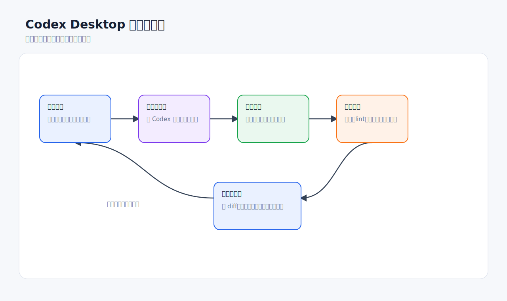

# Codex Desktop 使用技巧

资料核对日期：2026-06-11  
适用范围：Codex Desktop，重点面向 Windows 用户，同时兼顾 Codex app、CLI、IDE extension 的通用工作流。

这套文档的目标不是简单罗列按钮，而是把 Codex Desktop 作为一个日常开发搭档来讲清楚：如何给任务、如何控制上下文、如何安全改代码、如何验证结果、如何用浏览器看页面、如何用 Skills / Plugins / MCP 扩展能力，以及如何把稳定流程自动化。

> 图片说明：文档中的操作截图已替换为 OpenAI 官方开发者文档中的真实 Codex 产品截图。真实界面可能会因 Codex 版本、账号权限、操作系统和已安装插件不同而略有差异；截图来源见 [assets/screenshots/SOURCES.md](assets/screenshots/SOURCES.md)。

## 阅读顺序

如果你刚开始用 Codex Desktop，建议按下面顺序阅读：

1. [快速入门](01-快速入门.md)：打开项目、新建线程、选择模式和权限。
2. [提示词与任务拆解](02-提示词与任务拆解.md)：把模糊需求改写成 Codex 容易执行的任务。
3. [项目上下文与 AGENTS.md](03-项目上下文与AGENTS.md)：把长期项目规则沉淀下来。
4. [代码修改、测试与审查](04-代码修改测试与审查.md)：看 diff、跑测试、让结果可验收。
5. [Git 与并行工作流](05-Git与并行工作流.md)：使用 Worktree、提交和 PR。
6. [浏览器预览与前端调试](06-浏览器预览与前端调试.md)：用 in-app browser 做可视化验证。
7. [Skills、插件与 MCP](07-Skills插件与MCP.md)：为 Codex 增加可复用能力和外部工具。
8. [自动化与长期任务](08-自动化与长期任务.md)：让稳定流程定期运行。
9. [Windows 桌面端技巧](09-Windows桌面端技巧.md)：处理 PowerShell、WSL2、Git、终端和工具链。
10. [安全、权限与常见问题](10-安全权限与常见问题.md)：理解沙箱、批准、网络和隐私边界。
11. [Codex 桌面端设置详解](11-Codex桌面端设置详解.md)：完整梳理 Settings、快捷键、命令、Local environments 和此前遗漏的桌面端技巧。

专题扩展：

- [Codex 桌面端设置与计费规则专题](专题-Codex桌面端设置与计费规则/README.md)：更详尽地讲 Codex Desktop 设置、截图化操作逻辑、ChatGPT 计划、Credits、Rate Card、Business / Enterprise 管理和省额度策略。

## 核心原则

- **先让 Codex 理解上下文，再让它动手。** 复杂任务先要求“读代码、列计划、暂不改文件”。
- **一个线程处理一个目标。** 目标越清晰，diff 越容易审查，失败时也越容易回退。
- **用 Worktree 隔离探索性改动。** 不确定方向、并行任务、自动化任务优先隔离。
- **把反复出现的要求写进 AGENTS.md。** 不要每次复制同样的测试命令、风格规则和审查重点。
- **把结果当作候选补丁。** 看真实 diff、看测试输出、看残留风险，再决定接受、提交或继续修。
- **浏览器适合看页面，不适合登录态流程。** Codex app 的 in-app browser 适合 localhost 和无需登录的页面。
- **外部工具按需连接。** Skills 解决重复工作流，Plugins 负责打包分发，MCP 连接外部工具和动态上下文。
- **默认最小权限。** 需要写外部目录、联网、执行高风险命令时再短时提升，并在批准前看清动作。

## 好物推荐地图

官方最佳实践的核心建议是：不要一开始把所有工具都接上，先安装一两个能消除真实手工循环的工具。下面是更实用的选型地图，具体名称和可用性以你的 Codex Desktop 插件市场、Skills 列表、MCP servers 设置页为准。

| 想提升的效率 | 优先推荐 | 提升点 | 什么时候别装 |
| --- | --- | --- | --- |
| 查官方文档和 API 变化 | OpenAI Docs MCP / 文档查询类 MCP | 避免靠记忆写过时参数，适合 OpenAI、框架、SDK 文档核对 | 只是改当前仓库里的小函数时不必额外接 |
| 前端页面还原和视觉调试 | in-app browser、Browser 插件、Figma MCP | 让 Codex 看真实渲染结果、设计稿上下文和标注反馈 | 需要登录态网站时，优先考虑 Chrome 插件 |
| 登录态网页流程 | Chrome 插件 | 使用你的 Chrome 登录态、Cookie、扩展和标签上下文 | localhost 和公开页面优先用 in-app browser，降低隐私暴露 |
| 桌面软件操作 | Computer Use 插件 | 操作没有 API/MCP 的 Windows 应用 | 有专用插件或 MCP 时优先用结构化集成 |
| 表格、CSV、数据清洗 | Spreadsheets skill / `$spreadsheet`、Jupyter skill | 公式、表格格式、数据分析和可复现 notebook | 纯文本小表格直接让 Codex 处理即可 |
| 文档、PDF、汇报材料 | Documents、PDF、Presentations、Imagegen skills | 生成可交付文档、PPT、报告和配图 | 只是写 README 小段落时不必动用复杂产物工具 |
| 代码审查和安全审查 | GitHub 集成、Codex Security 插件、自定义 review skill | PR 审查、漏洞发现、验证证据和修复建议 | 未授权代码库不要做安全扫描 |
| 日常信息流和团队协作 | Slack、Gmail、Google Drive、Linear、GitHub 插件或 MCP | 汇总消息、issue、PR、文档和待办 | 没有明确输出目标时容易制造噪声 |
| 重复流程固化 | `$skill-creator`、`$skill-installer`、自定义 Skill | 把常用提示词升级为稳定工作流 | 流程还没跑顺时先别过早抽象 |
| 多步骤后台检查 | Automations + Skill + Worktree | 定期检查测试、依赖、PR、部署和日志 | 高风险写操作不要无人值守运行 |

我的建议安装顺序：

1. **基础层**：Browser / in-app browser、OpenAI Docs MCP、GitHub 或你实际使用的代码托管工具。
2. **工作层**：按岗位补充 Figma、Spreadsheets、Documents、Presentations、PDF、Chrome。
3. **团队层**：把稳定流程沉淀成 Skill，再考虑用 Plugin 分发。
4. **自动化层**：只把已经稳定、可审查、风险低的流程变成 Automation。

## 文档结构

每篇文档基本包含：

- 适合场景
- 操作步骤
- 推荐提示词
- 常见错误
- 检查清单
- 配图和官方参考资料

## 官方参考入口

- [Codex app](https://developers.openai.com/codex/app)
- [Codex app features](https://developers.openai.com/codex/app/features)
- [Codex app settings](https://developers.openai.com/codex/app/settings)
- [Codex app commands](https://developers.openai.com/codex/app/commands)
- [Local environments](https://developers.openai.com/codex/app/local-environments)
- [Codex app for Windows](https://developers.openai.com/codex/app/windows)
- [Best practices](https://developers.openai.com/codex/learn/best-practices)
- [In-app browser](https://developers.openai.com/codex/app/browser)
- [Custom instructions with AGENTS.md](https://developers.openai.com/codex/guides/agents-md)
- [Agent Skills](https://developers.openai.com/codex/skills)
- [Plugins](https://developers.openai.com/codex/plugins)
- [Model Context Protocol](https://developers.openai.com/codex/mcp)
