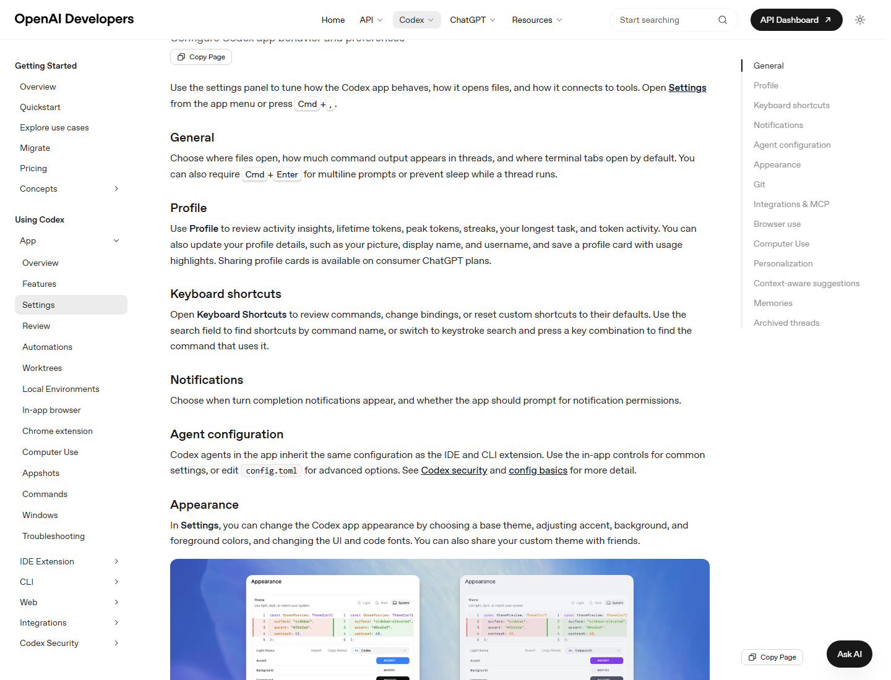

# 设置导航与推荐配置

Codex Desktop 的 Settings 不是“偏好设置”这么简单，它决定了 Codex 如何打开文件、如何显示命令输出、如何申请权限、如何连接外部工具、如何管理浏览器权限、如何使用 Git、如何接入 MCP，以及如何和 CLI / IDE Extension 共享配置。

## 设置页总地图

| 设置区 | 控制什么 | 第一优先级建议 |
| --- | --- | --- |
| General | 文件打开方式、命令输出、多行输入、终端标签、运行时防睡眠 | 第一天就检查 |
| Profile | 使用洞察、token 活动、个人资料、profile card | 需要了解用量趋势时看 |
| Keyboard Shortcuts | 查看、搜索、修改、重置快捷键 | 高频用户必须看 |
| Notifications | 任务完成、等待批准、系统通知权限 | 长任务用户必须开 |
| Agent configuration | 模型、权限、沙箱、网络、`config.toml` 等 | 安全和成本核心 |
| Appearance | 主题、颜色、字体、Codex pets | 长时间使用者建议调 |
| Git | 分支命名、force push、commit / PR prompt | 团队协作用户必须配 |
| Integrations & MCP | 推荐 MCP、自定义 MCP、OAuth 授权 | 连接外部工具时使用 |
| Browser use | Browser 插件、Chrome extension、allowed / blocked websites | 前端和网页任务必须看 |
| Computer Use | 桌面应用控制权限和偏好 | GUI-only 场景谨慎启用 |
| Personalization | Friendly / Pragmatic / None、自定义指令 | 控制默认风格和长期个人偏好 |
| Context-aware suggestions | 返回时提示可继续任务 | 多项目用户有用 |
| Memories | 跨线程记住稳定偏好 | 高频长期用户谨慎启用 |
| Archived threads | 查看和恢复归档线程 | 整理历史线程 |

## 第一天推荐配置

如果你刚开始用 Codex Desktop，建议按这个顺序检查：

1. **General**
   - 设置默认编辑器。
   - 打开 Prevent sleep while running。
   - 如果经常写长提示词，开启多行输入确认。

2. **Agent configuration**
   - 默认使用最小必要权限。
   - 不要一上来开 full access。
   - 需要联网时优先让 Codex 解释原因。

3. **Git**
   - 设置团队认可的分支命名前缀。
   - 默认不要允许 force push。
   - 配置 commit / PR description prompt。

4. **Browser use**
   - 本地页面优先使用 in-app browser。
   - 只有确实需要登录态时再配置 Chrome extension。
   - 定期清理 allowed / blocked websites。

5. **Integrations & MCP**
   - 先只接一个高频工具，例如 GitHub、Figma 或 OpenAI Docs。
   - 避免一次性接入大量 MCP。

6. **Local environments**
   - 为每个常用项目配置 setup scripts 和 actions。
   - 把 `npm test`、`npm run lint`、`npm run dev` 做成快捷动作。

## 三种推荐配置画像

### 个人开发者

| 设置 | 推荐 |
| --- | --- |
| General | 默认编辑器 + 防睡眠 + 多行输入确认 |
| Agent configuration | 默认沙箱，不长期 full access |
| Browser use | in-app browser + Browser plugin |
| MCP | OpenAI Docs 或 GitHub 二选一先接 |
| Git | `codex/` 或 `fix/` 分支前缀 |
| Notifications | 长任务完成通知 |
| Memories | 只存稳定偏好 |

### 前端 / 全栈

| 设置 | 推荐 |
| --- | --- |
| Browser use | in-app browser、Browser plugin、必要时 Chrome |
| Integrations & MCP | Figma MCP、GitHub MCP |
| Local environments | Dev server、Test、Lint、Build actions |
| Appearance | 浅色主题便于截图文档 |
| Notifications | dev server / build / visual QA 结束提醒 |
| Git | PR prompt 固定 Summary / Verification / Risk |

### 团队管理员

| 设置 | 推荐 |
| --- | --- |
| Agent configuration | 统一沙箱、网络、审批策略 |
| Integrations & MCP | 只启用团队认可工具 |
| Git | 禁止默认 force push，统一 PR 描述 |
| Browser use | 管理 allowed / blocked 网站策略 |
| Billing | 设置 workspace credits、automatic reload、spend controls |
| Memories | 明确哪些信息不应进入长期记忆 |

## 设置项与成本的关系

很多设置看起来只影响体验，实际也会影响用量：

| 设置或习惯 | 成本影响 |
| --- | --- |
| 启用很多 MCP | 每次上下文可能更大，消耗更多额度 |
| 很长的 AGENTS.md | 每轮都可能注入更多上下文 |
| 使用图片生成 | 官方说明平均会更快消耗 included limits |
| Fast mode | 官方说明约提升 1.5x 速度，但 GPT-5.5 按 2.5x、GPT-5.4 按 2x Standard rate 消耗 credits |
| 长线程不归档 | 上下文越来越大，任务更贵 |
| 大量自动化 | 后台消耗不易察觉，需要通知和 spend controls |
| Computer Use / Browser Use | 任务更长、步骤更多时会消耗更多消息或 credits |

## 设置修改原则

- **先局部，后全局。** 一次任务的约束写提示词；长期规则写 AGENTS.md、Skill 或 config。
- **先默认，后放宽。** 默认权限不够时，再解释原因并短时提升。
- **先一个工具，后多个工具。** MCP / Plugins 不是越多越好。
- **先可审查，后自动化。** 自动化前要先人工跑几次。
- **先看官方页面，后记笔记。** 计费和功能可用性变化快，文档需要定期更新。

## 检查清单

- [ ] 默认编辑器是否正确。
- [ ] 长任务是否会阻止电脑睡眠。
- [ ] 快捷键是否熟悉。
- [ ] 通知是否覆盖“完成”和“等待批准”。
- [ ] 沙箱和审批策略是否足够保守。
- [ ] 是否只启用了必要 MCP。
- [ ] Browser allowed / blocked 网站是否清理。
- [ ] Git 分支、提交、PR prompt 是否符合团队规范。
- [ ] Local environments 是否配置了常用 actions。
- [ ] 计费和 credits 是否知道在哪里查看。

## 官方参考

- [Codex app settings](https://developers.openai.com/codex/app/settings)
- [Codex app features](https://developers.openai.com/codex/app/features)
- [Local environments](https://developers.openai.com/codex/app/local-environments)
