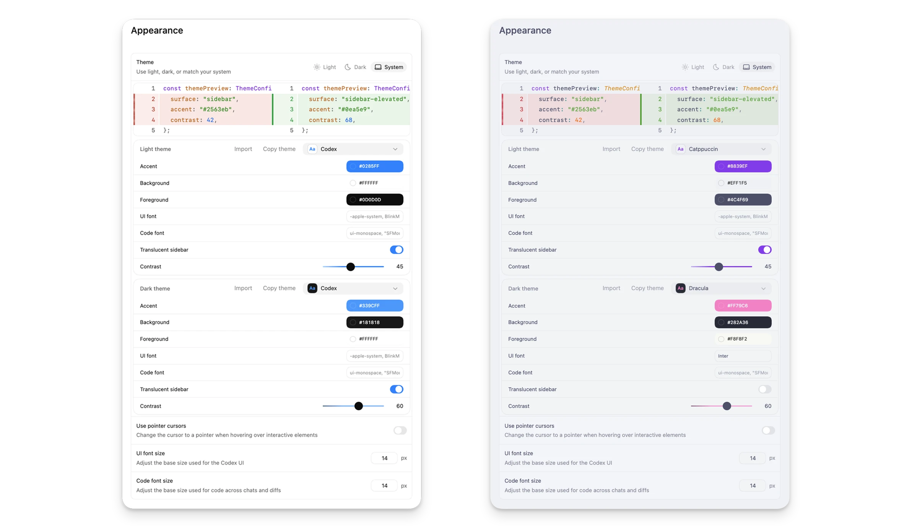

# 个人体验、外观、快捷键与通知

这一篇专讲不涉及代码安全边界的个人体验设置：General、Profile、Keyboard Shortcuts、Notifications、Appearance、Personalization、Context-aware suggestions、Memories 和 Archived threads。



## General：让桌面端顺手

General 是最应该优先调整的区域。

### 文件打开方式

设置 Codex 点击文件时打开哪个编辑器。推荐：

| 主要工作 | 推荐编辑器 |
| --- | --- |
| 前端 / Node / Python | VS Code |
| .NET / Windows 原生 | Visual Studio 或 VS Code |
| 纯文档 | VS Code、Obsidian 或系统默认 Markdown 编辑器 |

注意：

- 如果 Codex 打开的不是你想要的编辑器，优先查 General。
- 如果不同项目需要不同编辑器，可以在项目说明或 AGENTS.md 中写明。

### 命令输出显示

命令输出越多，线程越吵，也会增加阅读负担。建议：

- 测试失败时保留关键错误。
- 构建长日志让 Codex 摘要。
- 不要把完整 dependency install 日志都塞进线程。

提示词：

```text
运行测试后只总结失败用例、错误堆栈和相关文件。
不要把完整安装日志复制到最终回复。
```

### 多行输入

如果你经常写长提示词，建议开启多行输入确认，避免回车误发送。

适合：

- 写复杂任务说明。
- 粘贴需求和验收标准。
- 写多段代码审查要求。

### Prevent sleep while running

长任务、构建、自动化、浏览器验证都建议开启。否则电脑睡眠可能中断任务。

## Profile：不要只看 token，要看工作模式

Profile 可查看 activity insights、lifetime tokens、peak tokens、streaks、longest task 和 token activity。

你可以用它发现：

- 哪类任务特别消耗 token。
- 是否经常让 Codex 做过大的任务。
- 是否应该把重复提示词做成 Skill。
- 是否应该拆分任务或减少 MCP。

不要误解：

- token 用得多不代表效率高。
- longest task 长不代表任务完成得好。
- 真正的质量指标仍是：diff 是否小、测试是否跑、风险是否说明。

## Keyboard Shortcuts：值得专门花 10 分钟看

Settings > Keyboard Shortcuts 可以：

- 按命令名搜索。
- 按快捷键反查命令。
- 修改绑定。
- 重置默认快捷键。

高频动作建议熟悉：

| 动作 | 为什么重要 |
| --- | --- |
| Command menu | 快速打开设置、重载 skills、唤起命令 |
| New thread | 快速拆任务 |
| Search threads | 找历史任务 |
| Find in thread | 在长线程里找结论 |
| Toggle diff panel | 立刻看改动 |
| Toggle terminal | 立刻看命令和测试 |
| Settings | 快速调整权限、MCP、浏览器 |
| Dictation | 语音输入复杂需求 |

建议：

- 高频用户把 Toggle diff panel 和 Toggle terminal 放到顺手位置。
- 做教程或演示时，先确认快捷键和平台一致。
- Windows、macOS、Linux 快捷键可能不同，以设置页显示为准。

## Notifications：别错过“等待你批准”

Notifications 控制任务完成通知和权限请求提醒。

| 场景 | 建议 |
| --- | --- |
| 经常跑长测试 | 打开完成通知 |
| 经常用自动化 | 打开运行完成和失败提醒 |
| 经常遇到批准请求 | 打开等待批准提醒 |
| 录屏 / 直播 / 演示 | 临时关闭，避免泄露线程标题 |

建议配合提示词：

```text
如果你需要我批准命令，请先说明原因、路径和是否联网。
```

## Appearance：主题、字体和截图友好度

Appearance 可以调 base theme、accent、background、foreground、UI font、code font。

推荐：

- 写教程时用浅色主题，截图更清楚。
- 长时间编码时选择高对比但不刺眼的主题。
- 代码字体优先选等宽字体。
- 不要用过度个性化的颜色做团队文档截图。

## Codex pets

Codex pets 是可选动画伴随界面，能显示当前线程状态。你可以在 Appearance > Pets 中选择内置 pet，也可以通过 `hatch-pet` skill 创建。

适合：

- 喜欢更有状态感的桌面体验。
- 任务常在后台运行，需要轻量状态提示。

不适合：

- 录屏、直播、正式演示。
- 注意力容易被动画打断的人。

## Personalization

Personalization 可选择 Friendly、Pragmatic 或 None。

| 选项 | 推荐场景 |
| --- | --- |
| Friendly | 希望 Codex 更自然、解释更多 |
| Pragmatic | 希望 Codex 更工程化、更直接 |
| None | 希望尽量少个性化，只要任务结果 |

自定义个人指令要写稳定偏好，例如：

```text
默认用中文解释结果。代码注释遵循项目现有语言。
最终回复必须包含验证命令和结果。
```

不要写：

- 密钥。
- 一次性任务目标。
- 临时分支名。
- 会过期的项目事实。

## Context-aware suggestions

Context-aware suggestions 会在你启动或返回 Codex 时提示可继续任务。

建议开启：

- 多项目并行。
- 经常中断后恢复。
- 有长期线程或自动化。

建议关闭：

- 希望界面安静。
- 不希望历史任务影响当前任务。

## Memories

Memories 适合存稳定长期偏好，不适合存敏感信息。

适合存：

- 常用语言。
- 常用技术栈。
- 长期项目习惯。
- 喜欢的最终回复格式。

不适合存：

- API key。
- 客户数据。
- 隐私信息。
- 临时任务目标。

建议定期审查 Memories，删除过时或不应保留的信息。

## Archived threads

Archived threads 用来恢复已归档线程。

建议：

- 完成的线程及时归档。
- 重要线程先 pin。
- 归档前确认 worktree 是否还需要。
- 找历史结论时先 Search threads，再看 Archived threads。

## 推荐个人体验配置

| 偏好 | 推荐设置 |
| --- | --- |
| 高效开发 | Pragmatic + 快捷键 + diff/terminal 快捷切换 |
| 深度学习 | Friendly + 命令输出摘要 + Profile 复盘 |
| 低干扰 | None + 关闭 suggestions + 精简通知 |
| 长任务 | Prevent sleep + 通知 + pop-out + context-aware suggestions |
| 写教程 | 浅色主题 + 统一字体 + 使用官方截图 |

## 官方参考

- [Codex app settings](https://developers.openai.com/codex/app/settings)
- [Codex app commands](https://developers.openai.com/codex/app/commands)
- [Codex app features](https://developers.openai.com/codex/app/features)

