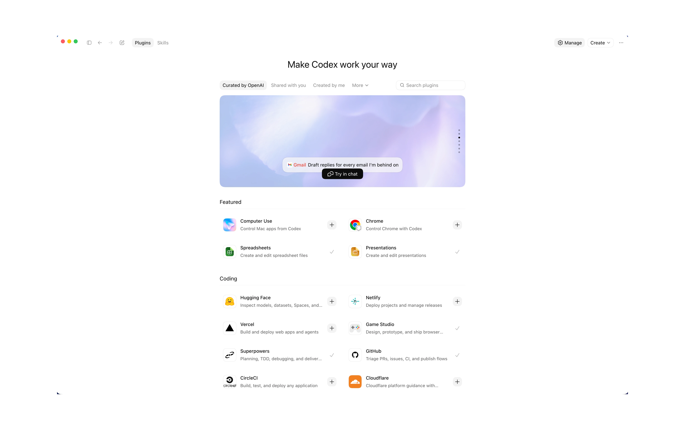
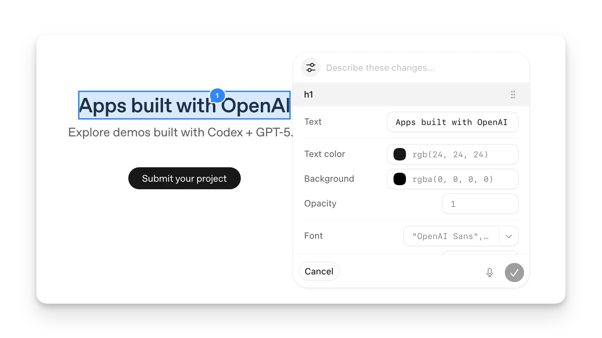
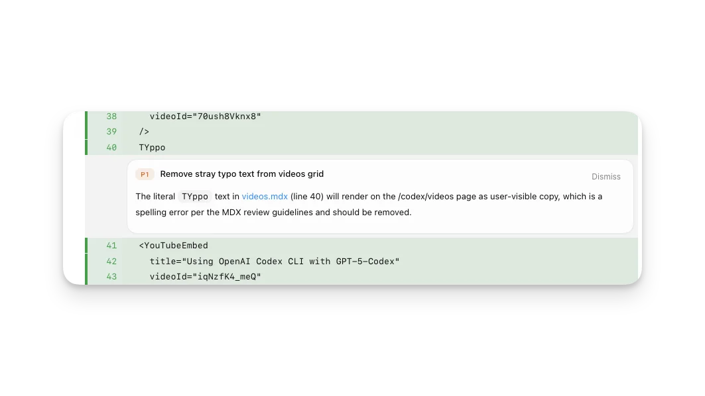
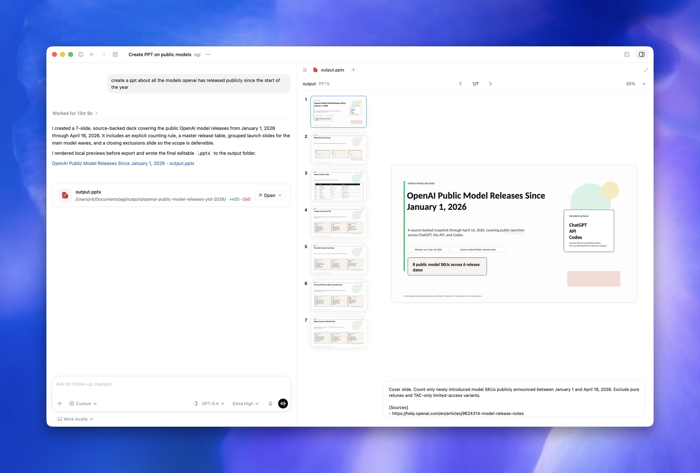
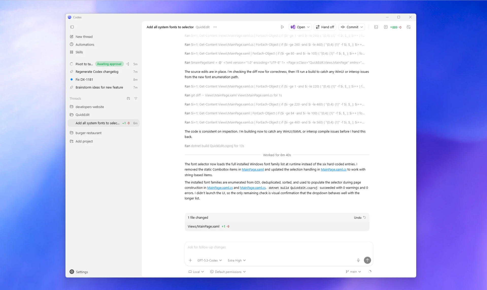
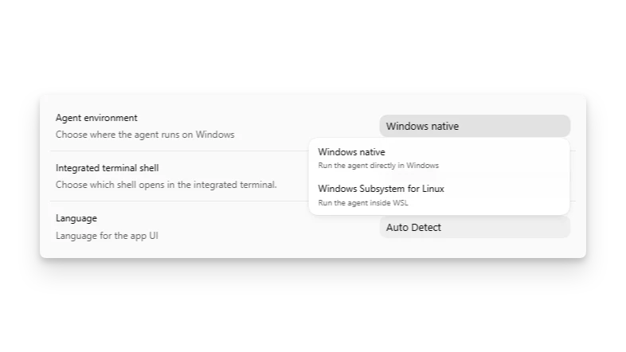

# 集成、浏览器、MCP、插件、Git 与自动化设置

这一篇讲 Codex Desktop 如何连接外部工具，以及这些连接如何影响效率、安全和用量。



## Integrations & MCP

MCP 用来连接外部工具、私有上下文和动态数据。设置页可以启用推荐 server，也可以添加自定义 server。如果 server 需要 OAuth，Codex app 会启动授权流程。

推荐优先级：

| 工具 | 推荐程度 | 适合 |
| --- | --- | --- |
| GitHub MCP / 集成 | 高 | issue、PR、CI、code review |
| Figma MCP | 高 | 前端实现设计稿 |
| OpenAI Docs MCP | 高 | 查最新 OpenAI 官方文档 |
| Browser | 高 | 本地页面预览和验证 |
| Linear / Jira | 中 | 需求和缺陷管理 |
| Slack / Gmail / Drive | 中 | 团队沟通和文档来源 |
| 自定义内部 MCP | 视情况 | 内部知识库、监控、工单系统 |

不要一开始接所有 MCP。官方 pricing 页面也提醒，MCP 越多，注入上下文越多，可能更快消耗用量。

## Browser use


Browser use 设置包含：

- bundled Browser plugin。
- Codex Chrome extension。
- allowed websites。
- blocked websites。

三种浏览器能力要分清：

| 能力 | 适合 | 不适合 |
| --- | --- | --- |
| in-app browser | localhost、静态预览、无需登录公开页面 | 登录态、Cookie、扩展 |
| Browser plugin | 让 Codex 操作可公开访问的页面 | 敏感网站 |
| Chrome extension | 使用真实 Chrome 登录态和扩展 | 能用 in-app browser 解决的本地页面 |

建议：

- 本地开发默认用 in-app browser。
- 需要 Codex 点击、检查页面时再用 Browser plugin。
- 需要登录态时才用 Chrome extension。
- 定期检查 allowed / blocked websites。

## Browser annotations



前端视觉问题建议用 annotation：

```text
这个区域在 390px 宽度下按钮溢出。
期望按钮换行或缩小间距，不要出现横向滚动。
```

不要只写：

```text
这里不好看，优化一下。
```

## Computer Use


Computer Use 适合没有 API、MCP 或插件的桌面应用。它很强，但也更容易产生外部副作用。

官方文档说明，Computer Use 在 macOS 和 Windows 可用，但在 EEA、英国和瑞士发布初期不可用。Windows 上它运行在当前活动桌面，会移动鼠标、输入并接管前台；如果你还想继续使用电脑，优先用虚拟机、备用设备远程查看，或先停止任务。

适合：

- 桌面应用 UI 测试。
- 复现 GUI-only bug。
- 操作没有结构化接口的本地工具。

不适合：

- 密码管理器。
- 付款、验证码、安全设置。
- 终端命令。
- 有专用 MCP / 插件 / API 的任务。

## Skills 与 Plugins


Skill 解决“重复工作流”，Plugin 解决“打包安装能力”。

推荐：

| 需求 | 推荐 |
| --- | --- |
| 每次都按同一流程审查 PR | 自定义 review skill |
| 每周生成报告 | Skill + automation |
| 生成 PPT / Word / Excel | Presentations / Documents / Spreadsheets skills |
| 团队分发一组能力 | Plugin |

## Git 设置


Git 设置建议关注：

- branch naming。
- 是否允许 force push。
- commit message prompt。
- PR description prompt。

推荐 PR prompt：

```text
Generate a PR description with:
1. Summary
2. Verification
3. Risk
Only claim tests passed when command output confirms success.
```

force push 建议默认关闭。只有在整理专门的 Codex 工作分支，并且团队允许时再使用。

## Worktrees


Worktree 适合：

- 并行任务。
- 自动化。
- 探索性重构。
- 当前 Local 有未提交改动。

注意：

- 需要 Git 仓库。
- 每个 worktree 可能重复依赖和构建缓存。
- 自动化 worktree 也会消耗磁盘和用量。

## Automations


自动化适合稳定、可审查的重复任务。

适合：

- 每日 CI 失败摘要。
- 每周 release notes 草稿。
- PR 状态提醒。
- 依赖更新观察。

不适合：

- 自动删除。
- 自动上传。
- 自动发布生产。
- 自动合并 PR。

创建自动化时写清：

```text
只读取信息，不修改文件，不发表评论，不推送代码。
输出进入 Triage，等待我审查。
```


## Review 设置与工作流



Review 面板是防止 Codex 乱改的核心。建议：

- 每次提交前看 changed files。
- 查看逐行 diff。
- 要求 Codex 解释无关改动。
- 运行测试并保留命令输出摘要。

## Artifacts



Codex app 可以预览 PDF、文档、表格、PPT 等非代码产物。适合：

- 文档生成。
- PPT 草稿。
- PDF 报告。
- 表格分析。

要求 Codex 生成这类产物时，要写清格式、页面、视觉检查和保存位置。

## Windows 与 WSL



Windows 用户需要确认：

- PowerShell 还是 WSL2。
- 默认终端。
- Git 是否在 PATH 中。
- 项目路径是否和工具链一致。



## 集成配置检查清单

- [ ] 是否只启用必要 MCP。
- [ ] 是否理解每个 MCP 的读写权限。
- [ ] Browser allowed / blocked websites 是否定期清理。
- [ ] Chrome extension 是否只用于登录态必要场景。
- [ ] Computer Use 是否只用于 GUI-only 场景。
- [ ] Skills 是否聚焦重复流程。
- [ ] Git prompt 是否符合团队规范。
- [ ] 自动化是否默认只读并进入审查。
- [ ] Worktree 磁盘占用是否可控。

## 官方参考

- [Model Context Protocol](https://developers.openai.com/codex/mcp)
- [Plugins](https://developers.openai.com/codex/plugins)
- [Agent Skills](https://developers.openai.com/codex/skills)
- [In-app browser](https://developers.openai.com/codex/app/browser)
- [Chrome extension](https://developers.openai.com/codex/app/chrome-extension)
- [Computer Use](https://developers.openai.com/codex/app/computer-use)
- [Codex app automations](https://developers.openai.com/codex/app/automations)
