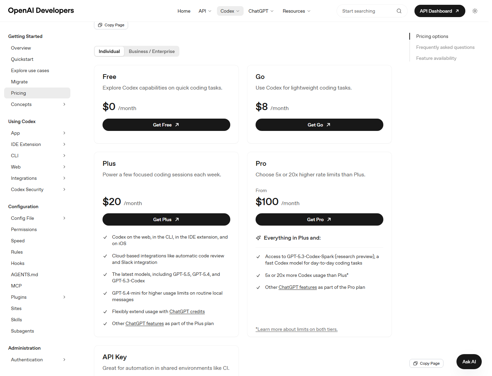

# 计费规则总览与计划选择

本篇讲 Codex 的计划选择和计费入口。价格、额度和可用功能会变化，本文以 2026-06-11 核对到的官方资料为准。

## 先分清两套计费逻辑

Codex 有两种常见使用方式：

| 使用方式 | 计费逻辑 | 适合 |
| --- | --- | --- |
| 使用 ChatGPT 账号登录 Codex | 使用 ChatGPT 计划内 Codex 用量；超出后按 credits 扩展 | 个人和团队日常开发 |
| 使用 API Key 登录 Codex | 按 OpenAI API token 标准价格计费 | CI/CD、脚本化、本地自动化、共享环境 |

关键区别：

- ChatGPT 登录通常能使用 Codex app、web、CLI、IDE、云端集成等计划内能力。
- API Key 模式适合程序化、本地、脚本化场景，但云端功能和 ChatGPT workspace 相关能力受限。
- API Key 使用 API 标准计费，不消耗 ChatGPT 计划内 credits。

## 个人计划

官方 Codex Pricing 页面显示，Codex 包含在 ChatGPT Free、Go、Plus、Pro、Business、Edu、Enterprise 计划中。

| 计划 | 官方价格信息 | 官方定位 | 适合谁 |
| --- | --- | --- | --- |
| Free | $0/month | 探索 Codex 快速编码任务 | 尝鲜、轻量体验 |
| Go | $8/month | 轻量编码任务 | 偶尔用 Codex 的个人 |
| Plus | $20/month | 每周几次聚焦编码会话 | 日常个人开发者 |
| Pro | From $100/month | 比 Plus 高 5x 或 20x 的 rate limits | 高频重度用户 |

### Free

适合：

- 试用 Codex。
- 小脚本、小问题。
- 了解桌面端工作流。

不适合：

- 长时间改大型代码库。
- 多线程并行。
- 频繁图片生成或复杂自动化。

### Go

适合：

- 轻量 coding。
- 偶尔让 Codex 看代码、解释代码、生成小片段。

注意：

- 如果超出后需要 credits 扩展，官方 Help Center 说明 Free 和 Go 用户会被提示升级到 Plus，而不是为 Codex 添加 credits。

### Plus

Plus 是大多数个人用户的起点。

官方页面列出 Plus 包含：

- Codex web、CLI、IDE extension、iOS。
- 云端集成，例如 automatic code review 和 Slack integration。
- 最新模型，包括 GPT-5.5、GPT-5.4、GPT-5.3-Codex。
- GPT-5.4-mini，用于 routine local messages 的更高用量。
- 可用 ChatGPT credits 灵活扩展。

适合：

- 每周几次聚焦 coding session。
- 需要本地 app + CLI + IDE Extension。
- 需要偶尔云端 code review 或 Slack 相关能力。

### Pro

Pro 适合高频、重度 Codex 用户。官方页面显示 Pro 有 5x 或 20x 高于 Plus 的 usage，并包含 GPT-5.3-Codex-Spark research preview。

适合：

- 每天长时间使用 Codex。
- 多项目、多线程、频繁本地消息。
- 需要更高 usage limits。
- 想使用 Spark research preview 的用户。

不适合：

- 只是偶尔让 Codex 改一个小文件。
- 团队需要集中管理用量和权限；这种更适合 Business / Enterprise。

## Business

Business 适合创业公司和成长型团队。官方 pricing 页面显示 Business 是 pay as you go，并包含：

- 可按团队需要分配标准 ChatGPT seats 或 usage-based Codex seats。
- 更大的虚拟机，让 cloud tasks 更快。
- 可用 ChatGPT credits 灵活扩展。
- 专用 workspace，包含 SAML SSO、MFA 等基本管理控制。
- Business data 默认不用于训练。

适合：

- 团队统一接入 Codex。
- 需要管理成员、席位、credits、权限。
- 希望有标准 seat 和 Codex-only seat 的组合。
- 需要 workspace-level spend controls。

## Enterprise / Edu

Enterprise / Edu 面向组织级部署。官方页面显示 Enterprise & Edu 包含 Business 能力，并增加企业级功能，例如 priority request processing 等。

适合：

- 需要统一合规、权限、审计。
- 需要合同级 credits pool。
- 需要 SSO、RBAC、管理配置、企业安全能力。
- 大型工程组织或教育机构。

注意：

- Enterprise / Edu 的 credits、overage、到期等通常由合同和 Order Form 定义。
- 具体应联系 OpenAI Account Team。

## API Key

API Key 适合：

- CI/CD。
- 共享自动化环境。
- 脚本化本地任务。
- Codex SDK、`codex exec`、程序化流程。

官方 pricing 页面说明 API Key：

- 适合 shared environments like CI。
- 支持 CLI、SDK、IDE extension。
- 不包含 cloud-based features，例如 GitHub code review、Slack 等。
- 新模型可能延迟可用。
- 按 API pricing 只为 Codex 使用的 tokens 付费。
- 当前 usage table 中，API Key 方式下 GPT-5.5 显示为 Not available，GPT-5.4 和 GPT-5.4-mini 显示为 usage-based；cloud tasks 和 code reviews 显示为 Not available。

不要误解：

- API Key 不是“免费绕过额度”。
- API Key 模式不消耗 ChatGPT plan credits，但会产生 API 账单。
- 不适合未受信任或公开环境。
- Fast mode credits 不适用于 API Key；使用 API Key 时按标准 API pricing 计费。

## 计划选择建议

| 使用模式 | 推荐 |
| --- | --- |
| 只是试试看 | Free |
| 偶尔轻量 coding | Go 或 Plus |
| 每周几次认真开发 | Plus |
| 每天长时间用 Codex | Pro 5x |
| 极重度个人用户 | Pro 20x |
| 团队统一使用和管理 | Business |
| 大型组织、合规、审计、统一管理 | Enterprise / Edu |
| CI/CD、脚本化、自动化 | API Key |

## 计划选择的隐藏变量

不要只看月费，还要看：

- 是否需要云端任务。
- 是否需要 GitHub code review。
- 是否需要 Slack / Linear 等集成。
- 是否需要 Chrome / Computer Use / Browser automation。
- 是否需要团队统一管理。
- 是否有大量图片生成。
- 是否会用很多 MCP。
- 是否需要自动化长期运行。
- 是否需要 API Key 和 CI/CD。

## 官方参考

- [Codex Pricing](https://developers.openai.com/codex/pricing)
- [Using Codex with your ChatGPT plan](https://help.openai.com/en/articles/11369540-using-codex-with-your-chatgpt-plan)
- [Authentication](https://developers.openai.com/codex/auth)
