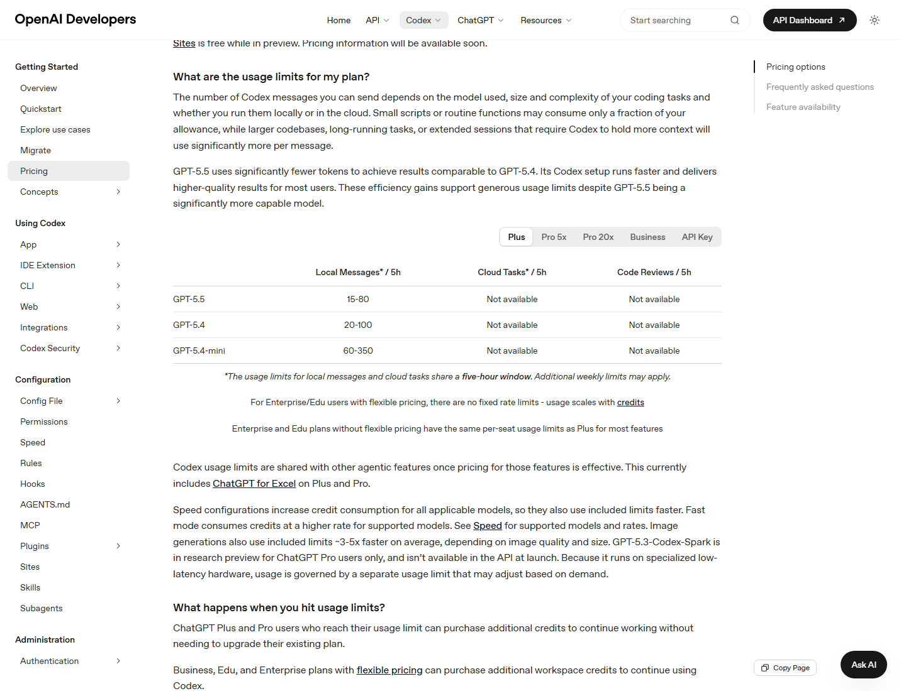
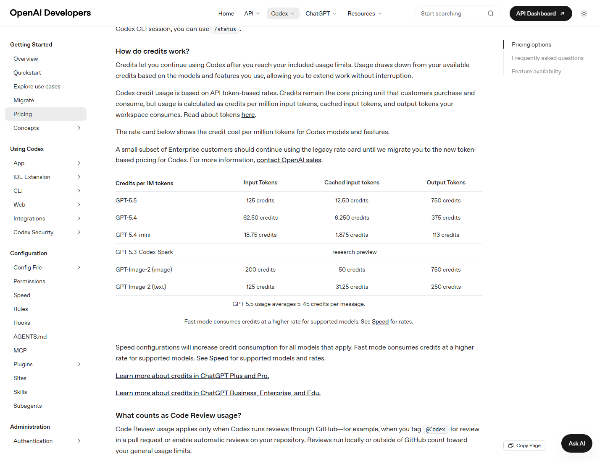

# 用量限制、Credits 与 Rate Card

本篇讲 Codex 的 usage limits、credits、rate card、image generation、Fast mode 和用量查询。计费数字变化较快，所有数字以 2026-06-11 核对到的官方资料为准。

## 用量限制由什么决定

官方 pricing 页面说明，你能发送多少 Codex messages，取决于：

- 使用的模型。
- 编码任务大小和复杂度。
- 本地运行还是云端运行。
- 代码库大小。
- 长时间会话是否需要保留更多上下文。
- 是否使用图片生成、Fast mode、MCP 等。

简单任务可能只消耗 allowance 的一小部分；大代码库、长任务、长上下文会明显更贵。

## 5 小时窗口

官方表格中的 local messages 和 cloud tasks 共享一个 5 小时窗口，且可能还有额外 weekly limits。

要点：

- 不是每天固定重置一次。
- 当前窗口里任务越重，可用次数越少。
- 切换到较小模型可以让额度更耐用。
- 使用 `/status` 可以在 CLI session 中查看剩余额度。
- Codex usage dashboard 可查看当前 limits。

## 当前官方表格中的 local messages 范围

以下是官方 Codex Pricing 页面在 2026-06-11 显示的范围。由于官方以区间展示，实际可用量会随任务大小和上下文变化。

| 计划 | GPT-5.5 local messages / 5h | GPT-5.4 local messages / 5h | GPT-5.4-mini local messages / 5h |
| --- | --- | --- | --- |
| Plus | 15-80 | 20-100 | 60-350 |
| Pro 5x | 80-400 | 100-500 | 300-1750 |
| Pro 20x | 300-1600 | 400-2000 | 1200-7000 |
| Business | 15-80 | 20-100 | 60-350 |

重要说明：

- Enterprise / Edu with flexible pricing 没有固定 rate limits，usage 会随 credits 扩展。
- Enterprise / Edu 如果没有 flexible pricing，大多数功能使用 Plus 类似的 per-seat limits。
- API Key 不走 ChatGPT 计划内 local-message 额度；官方 usage table 当前显示 GPT-5.5 为 Not available，GPT-5.4 和 GPT-5.4-mini 为 usage-based，cloud tasks 和 code reviews 为 Not available。

## Credits 怎么工作

官方说明：

- Credits 让你在计划内额度用完后继续使用 Codex。
- 使用时会根据模型和功能，从可用 credits 中扣除。
- Codex credit usage 基于 API token-based rates。
- 计算维度包括 input tokens、cached input tokens、output tokens。

## 当前 Codex Rate Card

官方页面显示的 credits per 1M tokens：

| 模型 / 功能 | Input tokens | Cached input tokens | Output tokens |
| --- | --- | --- | --- |
| GPT-5.5 | 125 credits | 12.50 credits | 750 credits |
| GPT-5.4 | 62.50 credits | 6.250 credits | 375 credits |
| GPT-5.4-mini | 18.75 credits | 1.875 credits | 113 credits |
| GPT-5.3-Codex-Spark | research preview | research preview | research preview |
| GPT-Image-2 image | 200 credits | 50 credits | 750 credits |
| GPT-Image-2 text | 125 credits | 31.25 credits | 250 credits |

官方还说明：GPT-5.5 usage averages 5-45 credits per message。

怎么理解：

- output tokens 通常更贵。
- cached input tokens 明显便宜。
- mini 模型更省。
- 图片相关功能消耗更快。
- Spark 是 research preview，受单独规则影响。

## Plus / Pro credits

Help Center 说明：

- 计划内 included usage 会先被使用。
- 达到计划限制后，usage 会从 credit balance 扣除。
- Plus 和 Pro 用户达到 Codex 限制时，会看到添加 credits 的选项。
- 也可以在 Codex Settings > Usage > Credits 购买 credits。
- eligible Plus / Pro users 可开启 Auto top-up。
- Free 和 Go 用户会被提示升级到 Plus，而不是为 Codex 添加 credits。

Auto top-up 逻辑：

- 设置 minimum balance。
- 设置 target balance。
- 余额低于 minimum 时，用默认支付方式自动购买到 target。
- 如果开启时余额已经低于 minimum，可能立即购买。
- 共享 credits 可以用于支持的多个功能。

## Credits 有效期和退款

Help Center 说明：

- Credits 购买后 12 个月有效。
- 未用完 credits 到期后不会 rollover。
- Credits 不可转让、无现金价值、不可转售或赠送。
- 除法律要求外通常不退款。
- 如果账号被盗导致 credits 被消耗，应立即联系 support@openai.com。

## Image generation 如何计入

官方 pricing 页面说明：

- Image generation 计入与 local messages、cloud tasks 相同的一般 Codex usage limits。
- 平均比不生成图片的类似 turn 快 3-5 倍消耗 included limits，取决于图片质量和尺寸。
- 达到 included limits 后，图片生成也从 credits 扣除。
- Free plan 不可用 image generation。
- API Key 模式下，图片生成按 API pricing，而不是 ChatGPT included usage limits。

## Fast mode 和 Speed 配置

官方说明：

- Fast mode 会让支持模型的速度提升约 1.5x。
- Fast mode 当前支持 GPT-5.5 和 GPT-5.4。
- GPT-5.5 在 Fast mode 下按 2.5x Standard rate 消耗 credits。
- GPT-5.4 在 Fast mode 下按 2x Standard rate 消耗 credits。
- Fast mode 可用于 ChatGPT 登录下的 Codex IDE extension、CLI 和 app。
- API Key 使用标准 API pricing，不能使用 Fast mode credits。
- Codex-Spark 是单独模型，不是 Fast mode；它有自己的 usage limits。

建议：

- 大量简单任务不要默认 Fast mode。
- 先用普通速度完成探索，再对需要实时迭代的局部任务开启快速配置。
- 成本敏感时优先用 GPT-5.4-mini 处理 routine local messages。

## Code Review usage 怎么算

官方 pricing 页面说明，Code Review usage 只适用于 Codex 通过 GitHub 运行 review 的场景，例如：

- 在 PR 中 tag `@Codex` 进行 review。
- 为 repository 启用 automatic reviews。

本地 review 或 GitHub 外部的 review 计入 general usage limits。

## Where can I see current limits

官方说明：

- Codex usage dashboard 可查看 current limits。
- CLI session 中可以用 `/status` 查看剩余额度。
- Plus / Pro credits 可在 Codex Settings > Usage > Credits / Usage Dashboard 查看。

## 什么会让用量变快

| 行为 | 为什么更贵 |
| --- | --- |
| 大型代码库长线程 | 上下文更多 |
| 把完整日志贴进线程 | input tokens 增加 |
| 输出长报告 | output tokens 增加 |
| 很多 MCP 同时启用 | 工具描述和上下文增加 |
| AGENTS.md 过长 | 每轮注入规则更多 |
| 图片生成 | 官方说明平均 3-5x |
| Fast mode | GPT-5.5 按 2.5x、GPT-5.4 按 2x Standard rate 消耗 credits |
| 自动化频繁运行 | 后台持续消耗 |
| 多 agent / subagents | 并行代理各自消耗上下文 |

## 官方参考

- [Codex Pricing](https://developers.openai.com/codex/pricing)
- [Using Credits for Flexible Usage in ChatGPT](https://help.openai.com/en/articles/12642688-using-credits-for-flexible-usage-in-chatgpt-freegopluspro)
- [Codex Speed](https://developers.openai.com/codex/speed)
- [Codex models](https://developers.openai.com/codex/models)
