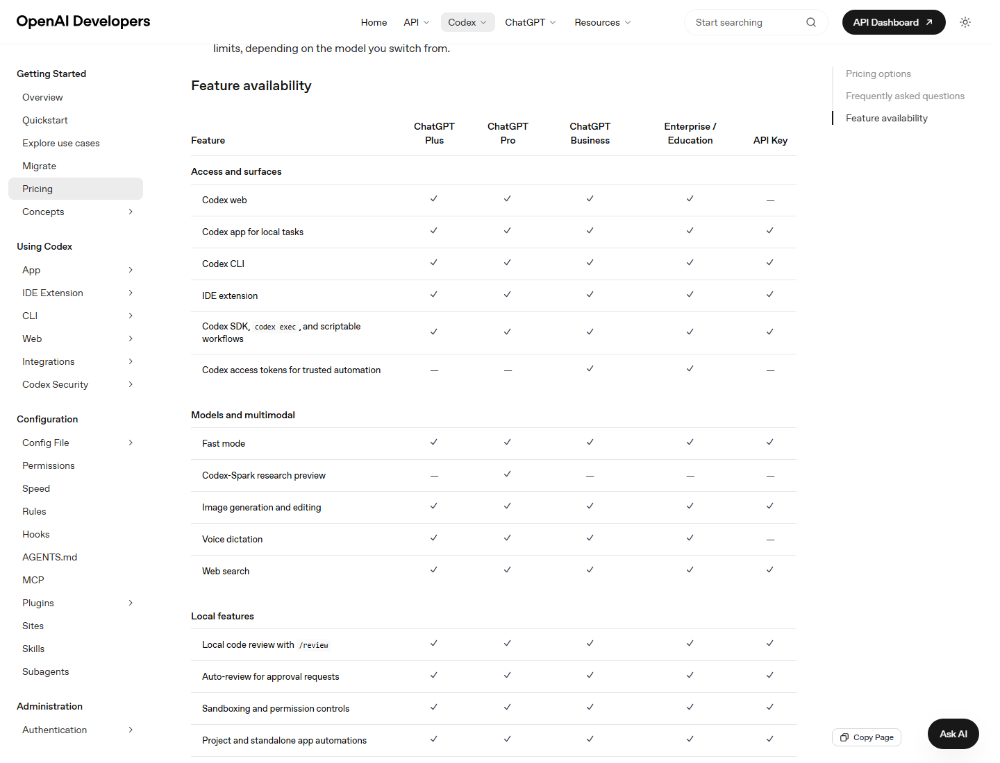

# 省额度技巧、排障与检查清单

本篇把设置和计费结合起来，回答三个实际问题：为什么用量消耗很快、怎么让额度更耐用、管理员和个人如何定期检查。



## 省额度的核心原则

官方 pricing 页面给出的优化建议包括：

- 控制 prompt size。
- 移除不必要上下文。
- 减少 AGENTS.md 的体积，必要时用嵌套文件控制注入范围。
- 限制 MCP servers 数量，不需要时禁用。
- 对 routine tasks 切换到 smaller model，例如 GPT-5.4 或 GPT-5.4-mini。

这些建议可以转成一个简单原则：

> 给 Codex 的上下文越精确，任务越小，模型越合适，用量越耐用。

## 个人用户省额度清单

### 1. 拆任务

不推荐：

```text
帮我优化整个项目。
```

推荐：

```text
只读分析登录模块，列出 3 个最可能导致保存失败的原因，不要改文件。
```

好处：

- 更少上下文。
- 更少回合。
- 更少无关 diff。
- 更容易用小模型完成。

### 2. 控制提示词长度

提示词要具体，但不要贴无关内容。

推荐结构：

```text
目标：
范围：
不改：
验收：
输出格式：
```

不要粘贴：

- 全部日志。
- 全部 README。
- 整个 PR 讨论。
- 与任务无关的代码。

### 3. 精简 AGENTS.md

AGENTS.md 会给 Codex 持久上下文。太长会增加用量。

建议：

- 根目录写通用规则。
- 子目录写局部规则。
- 大段背景放链接，不直接塞主文件。
- 删除过时命令。
- 把 review checklist 放独立文件，只在 review 时引用。

### 4. 关掉不需要的 MCP

每个 MCP 都可能增加工具描述和上下文。

建议：

- 当前任务不用 Figma，就禁用或不触发。
- 当前任务不用 GitHub，就不要让 Codex拉 PR 全上下文。
- 当前任务只是本地改 CSS，不需要一堆协作工具。

### 5. 用小模型做 routine tasks

适合小模型：

- 查找文件。
- 改文案。
- 解释短函数。
- 生成小脚本。
- 修格式。
- 写简单测试。

适合强模型：

- 跨模块重构。
- 安全审查。
- 架构迁移。
- 多工具任务。
- 难复现 bug。

### 6. 减少图片生成

官方说明 image generation 平均会更快消耗 included limits。建议：

- 真实截图用官方截图或本机截图。
- 流程图用 Mermaid 或 SVG。
- 只有确实需要原创视觉素材时再 image generation。

### 7. 谨慎使用 Fast mode

Fast mode 提升速度，但官方说明会以更高 rate 消耗：速度约提升 1.5x，GPT-5.5 按 2.5x Standard rate 消耗 credits，GPT-5.4 按 2x Standard rate 消耗 credits。API Key 使用标准 API pricing，不能使用 Fast mode credits。建议：

- 实时小迭代时使用。
- 大型调研和长任务不要默认开启。
- 成本敏感时优先普通速度。

## 团队省额度策略

### 1. 按角色设置 spend controls

| 角色 | 策略 |
| --- | --- |
| 新成员 | 低额度，观察使用习惯 |
| 核心开发 | 较高额度 |
| 自动化账号 | 明确上限，必须审计 |
| 安全负责人 | 根据扫描需求提高 |
| 产品 / 文档用户 | 限制图片生成和大型自动化 |

### 2. 自动化默认只读

自动化最容易在后台消耗 credits。

建议：

- 首次自动化只读。
- 前几次运行进入人工审查。
- 写操作必须明确范围。
- 设置自动化运行频率上限。
- 用 Worktree 隔离。

### 3. PR review 控制触发条件

GitHub automatic review 会计入相关 usage。建议：

- 只对目标仓库启用。
- 对 draft PR 可延迟 review。
- 对超大 PR 先让 Codex 做文件级摘要，再人工决定是否完整 review。
- 安全扫描只对授权仓库运行。

### 4. 统一项目模板

每个项目应有：

- 精简 AGENTS.md。
- test / lint / build actions。
- 推荐模型策略。
- MCP 使用说明。
- 自动化范围。
- PR prompt。

## 为什么突然用量变快

排查顺序：

1. 最近是否启用了更多 MCP。
2. AGENTS.md 是否变长。
3. 是否开始使用图片生成。
4. 是否开启 Fast mode。
5. 是否创建了自动化。
6. 是否让 Codex 处理更大代码库。
7. 是否让 Codex 输出长报告。
8. 是否用强模型处理 routine tasks。
9. 是否出现长失败日志反复注入。
10. 是否有人或某个 seat 超出 workspace average。

## 为什么 Credits 被扣了

可能原因：

- 计划内 usage 已耗尽。
- Plus / Pro 开启了 credits 或 auto top-up。
- Business workspace 里的 Codex seat 正在使用。
- 自动化后台运行。
- API Key 模式产生 API usage。
- 图片生成、Fast mode 或大上下文任务消耗更高。
- ChatGPT for Excel 等支持功能共享 credits。

## 个人排障提示词

```text
请帮我分析这次 Codex 任务为什么可能消耗较多额度。
请只基于当前线程信息判断：
1. 上下文是否过长；
2. 是否启用了很多 MCP；
3. 是否用了图片生成或 Fast mode；
4. 是否任务范围过大；
5. 下次如何拆分任务更省。
```

## 管理员排障提示词

```text
请根据 workspace usage 报告帮我找出成本异常点。
重点看：
1. 哪些 seat 或 user 增长最快；
2. 是否有自动化异常频繁；
3. 是否有 API Key 或 CI/CD 任务消耗异常；
4. 是否需要设置 per-user override；
5. 是否需要调整 automatic reload 和 monthly recharge limit。
```

## 设置检查总表

| 检查项 | 个人 | 团队管理员 |
| --- | --- | --- |
| 默认模型 | 每月检查 | 提供团队建议 |
| MCP 数量 | 每个项目检查 | 统一推荐列表 |
| AGENTS.md 长度 | 每个仓库检查 | 模板化 |
| 自动化 | 每周检查 | 设置范围和频率 |
| Credits balance | 需要时查看 | 每周查看 |
| Auto top-up | 谨慎开启 | 必须设置上限 |
| Spend controls | 不适用 | 按 seat / user 配置 |
| API Key | 尽量不用个人 key 共享 | 单独管理和轮换 |
| 图片生成 | 按需使用 | 限制高频生成 |
| GitHub review | PR 前确认 | 控制触发仓库 |

## 最终推荐配置

### 省心个人配置

- Plus 或 Pro。
- 默认较强模型，但 routine task 切小模型。
- 只接 GitHub 或 OpenAI Docs 一个高频 MCP。
- Browser use 默认 in-app browser。
- 自动化只读。
- Credits 不开 auto top-up，或设置很低 target。

### 高效前端配置

- Figma MCP。
- Browser / in-app browser。
- Dev server action。
- frontend visual QA skill。
- 图片生成仅用于原创素材，不用于真实截图。
- 每次视觉改动后跑浏览器验证。

### 团队成本可控配置

- Business workspace。
- 使用 standard seats + Codex seats 组合。
- automatic reload 设置 monthly recharge limit。
- per-user override 覆盖异常用户。
- 自动化账号单独限额。
- 每周下载 usage report。
- MCP 和 plugins 白名单化。

## 官方参考

- [Codex Pricing](https://developers.openai.com/codex/pricing)
- [Using Credits for Flexible Usage in ChatGPT](https://help.openai.com/en/articles/12642688-using-credits-for-flexible-usage-in-chatgpt-freegopluspro)
- [Managing credits and spend controls in ChatGPT Business](https://help.openai.com/en/articles/20001155-managing-credits-and-spend-controls-in-chatgpt-business)
- [Flexible pricing for Enterprise, Edu, and Business](https://help.openai.com/en/articles/11487671-flexible-pricing-for-the-enterprise-edu-and-business-plans)
- [Best practices](https://developers.openai.com/codex/learn/best-practices)
