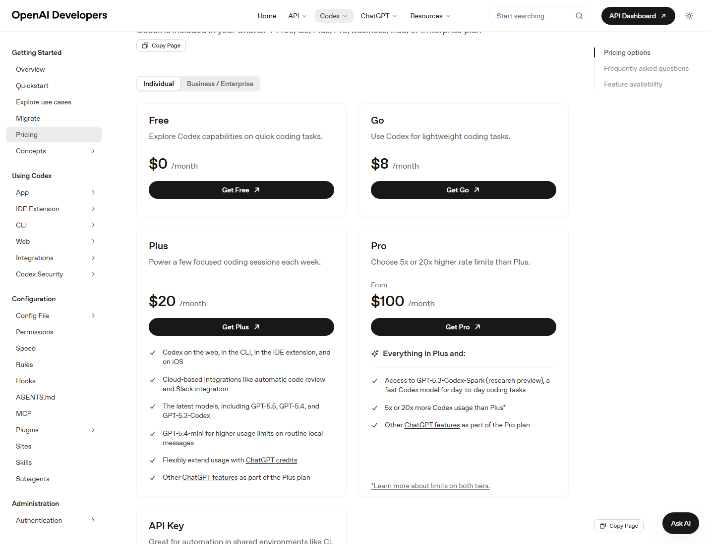

# Codex 桌面端设置与计费规则专题

资料核对日期：2026-06-11  
适用对象：使用 Codex Desktop 的个人用户、开发者、团队管理员、希望控制用量和成本的用户。

这组文档专门讲两件事：

1. **Codex Desktop 设置怎么配**：不只说明按钮在哪里，而是讲每个设置影响什么、推荐怎么选、什么场景要谨慎。
2. **Codex 计费和用量规则怎么理解**：包括 ChatGPT 计划、Credits、API Key、Business / Enterprise 工作区、usage limits、rate card、用量优化和成本治理。

> 计费规则会变化。本文档中的价格、额度、模型和 credit rate 以 2026-06-11 核对到的 OpenAI 官方资料为准，后续应以 [Codex Pricing](https://developers.openai.com/codex/pricing) 和 OpenAI Help Center 为准。

## 阅读顺序

1. [设置导航与推荐配置](01-设置导航与推荐配置.md)  
   先建立设置页全局地图，知道每个区域管什么。

2. [个人体验、外观、快捷键与通知](02-个人体验外观快捷键通知.md)  
   适合想把 Codex Desktop 调顺手的人。

3. [Agent 配置、权限、沙箱、网络与本地环境](03-Agent配置权限沙箱网络与本地环境.md)  
   适合关注安全边界、模型选择、权限策略和本地命令的人。

4. [集成、浏览器、MCP、插件、Git 与自动化设置](04-集成浏览器MCP插件Git自动化.md)  
   适合想连接 GitHub、Figma、Chrome、Browser、MCP、Skills 和 Automations 的人。

5. [计费规则总览与计划选择](05-计费规则总览与计划选择.md)  
   讲 Free、Go、Plus、Pro、Business、Enterprise/Edu、API Key 的差异。

6. [用量限制、Credits 与 Rate Card](06-用量限制Credits与RateCard.md)  
   讲 5 小时窗口、local messages、credits、tokens、image generation、Fast mode。

7. [团队计费、Business / Enterprise 管理与 API Key](07-团队计费APIKey与管理员治理.md)  
   讲 workspace credits、Codex seats、automatic reload、spend controls、API Key。

8. [省额度技巧、排障与最终检查清单](08-省额度技巧排障与检查清单.md)  
   讲怎么少烧额度、怎么判断为什么用量变快、管理员和个人如何检查。

## 截图来源

本专题截图分两类：

- OpenAI 官方文档中的 Codex 产品截图，直接下载到本地。
- 使用本机 Edge 对 OpenAI 官方网页进行无登录截图，页面内容来自公开官方文档。

截图来源清单见 [assets/screenshots/SOURCES.md](assets/screenshots/SOURCES.md)。

## 关键结论

- Codex Desktop 的 Settings 是控制体验、权限、工具、外部连接和长期偏好的核心入口。
- `config.toml` 是 app、CLI、IDE Extension 共享高级配置的关键文件。
- Credits 是超过计划内使用量后的弹性扩展方式；Plus / Pro 个人用户和 Business / Enterprise / Edu 工作区规则不同。
- API Key 模式按 API token 计费，不消耗 ChatGPT 计划内 Codex credits，但云端集成能力受限。
- MCP、AGENTS.md、长上下文、图片生成、Fast mode、复杂任务和长线程都会影响用量；官方 Speed 文档说明 Fast mode 约提升 1.5x 速度，但 GPT-5.5 按 2.5x、GPT-5.4 按 2x Standard rate 消耗 credits。
- 团队应设置 usage alerts、spend controls、automatic reload 和权限策略，避免无人值守烧额度。

## 官方资料入口

- [Codex app settings](https://developers.openai.com/codex/app/settings)
- [Codex app features](https://developers.openai.com/codex/app/features)
- [Codex app commands](https://developers.openai.com/codex/app/commands)
- [Local environments](https://developers.openai.com/codex/app/local-environments)
- [Codex Pricing](https://developers.openai.com/codex/pricing)
- [Using Codex with your ChatGPT plan](https://help.openai.com/en/articles/11369540-using-codex-with-your-chatgpt-plan)
- [Using Credits for Flexible Usage in ChatGPT](https://help.openai.com/en/articles/12642688-using-credits-for-flexible-usage-in-chatgpt-freegopluspro)
- [Managing credits and spend controls in ChatGPT Business](https://help.openai.com/en/articles/20001155-managing-credits-and-spend-controls-in-chatgpt-business)
- [Flexible pricing for Enterprise, Edu, and Business](https://help.openai.com/en/articles/11487671-flexible-pricing-for-the-enterprise-edu-and-business-plans)
